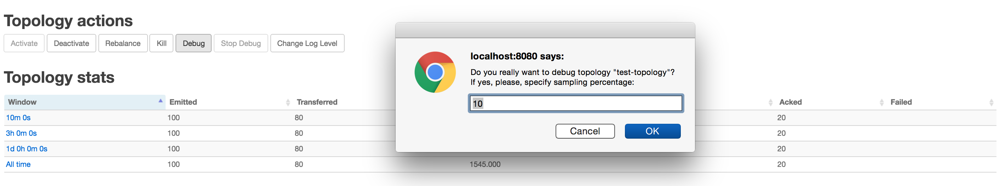
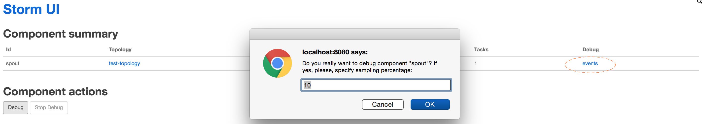
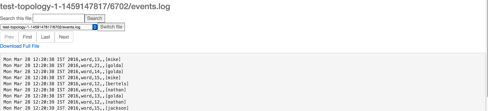
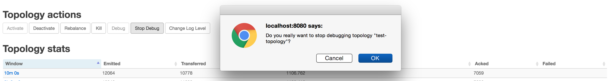

# Introduction

Topology event inspector provides the ability to view the tuples as it flows through different stages in a storm topology.
This could be useful for inspecting the tuples emitted at a spout or a bolt in the topology pipeline while the topology is running, without stopping or redeploying the topology. The normal flow of tuples from the spouts to the bolts is not affected by turning on event logging.

## Enabling event logging

Note: Event logging needs to be enabled first by setting the storm config "topology.eventlogger.executors" to a non zero value. Please see
the [Configuration](#config) section for more details.

Events can be logged by clicking the "Debug" button under the topology actions in the topology view. This logs the
tuples from all the spouts and bolts in a topology at the specified sampling percentage.

<div align="center">


<p>Figure 1: Enable event logging at topology level.</p>
</div>

You could also enable event logging at a specific spout or bolt level by going to the corresponding component page and
clicking "Debug" under component actions.

<div align="center">


<p>Figure 2: Enable event logging at component level.</p>
</div>

## Viewing the event logs
The Storm "logviewer" should be running for viewing the logged tuples. If not already running log viewer can be started by running the "bin/storm logviewer" command from the storm installation directory. For viewing the tuples, go to the specific spout or bolt component page from storm UI and click on the "events" link under the component summary (as highlighted in Figure 2 above).

This would open up a view like below where you can navigate between different pages and view the logged tuples.

<div align="center">


<p>Figure 3: Viewing the logged events.</p>
</div>

Each line in the event log contains an entry corresponding to a tuple emitted from a specific spout/bolt in a comma separated format.

`Timestamp, Component name, Component task-id, MessageId (in case of anchoring), List of emitted values`

## Disabling the event logs

Event logging can be disabled at a specific component or at the topology level by clicking the "Stop Debug" under the topology or component actions in the Storm UI.

<div align="center">


<p>Figure 4: Disable event logging at topology level.</p>
</div>

## <a name="config"></a>Configuration
Eventlogging works by sending the events (tuples) from each component to an internal eventlogger bolt. By default Storm does not start any event logger tasks, but this can be easily changed by setting the below parameter while running your topology (by setting it in storm.yaml or passing options via command line).

| Parameter  | Meaning |
| -------------------------------------------|-----------------------|
| "topology.eventlogger.executors": 0      | No event logger tasks are created (default). |
| "topology.eventlogger.executors": 1      | One event logger task for the topology. |
| "topology.eventlogger.executors": nil      | One event logger task per worker. |


## Extending eventlogging
Storm provides an `IEventLogger` interface which is used by the event logger bolt to log the events. The default implementation for this is a FileBasedEventLogger which logs the events to an events.log file ( `logs/workers-artifacts/<topology-id>/<worker-port>/events.log`). Alternate implementations of the `IEventLogger` interface can be added to extend the event logging functionality (say build a search index or log the events in a database etc)

```java
/**
 * EventLogger interface for logging the event info to a sink like log file or db
 * for inspecting the events via UI for debugging.
 */
public interface IEventLogger {
    /**
    * Invoked during eventlogger bolt prepare.
    */
    void prepare(Map stormConf, TopologyContext context);

    /**
     * Invoked when the {@link EventLoggerBolt} receives a tuple from the spouts or bolts that has event logging enabled.
     *
     * @param e the event
     */
    void log(EventInfo e);

    /**
    * Invoked when the event logger bolt is cleaned up
    */
    void close();
}
```
