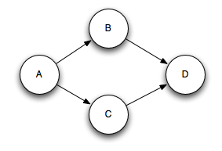
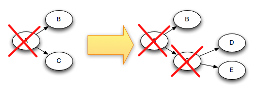

Storm guarantees that each message coming off a spout will be fully processed. This page describes how Storm accomplishes this guarantee and what you have to do as a user to benefit from Storm's reliability capabilities.

### What does it mean for a message to be "fully processed"?

A tuple coming off a spout can trigger thousands of tuples to be created based on it. Consider, for example, the streaming word count topology:

```java
TopologyBuilder builder = new TopologyBuilder();
builder.setSpout("sentences", new KestrelSpout("kestrel.backtype.com",
                                               22133,
                                               "sentence_queue",
                                               new StringScheme()));
builder.setBolt("split", new SplitSentence(), 10)
        .shuffleGrouping("sentences");
builder.setBolt("count", new WordCount(), 20)
        .fieldsGrouping("split", new Fields("word"));
```

This topology reads sentences off of a Kestrel queue, splits the sentences into its constituent words, and then emits for each word the number of times it has seen that word before. A tuple coming off the spout triggers many tuples being created based on it: a tuple for each word in the sentence and a tuple for the updated count for each word. The tree of messages looks something like this:


Storm considers a tuple coming off a spout "fully processed" when the tuple tree has been exhausted and every message in the tree has been processed. A tuple is considered failed when its tree of messages fails to be fully processed within a specified timeout. This timeout can be configured on a topology-specific basis using the [Config.TOPOLOGY_MESSAGE_TIMEOUT_SECS](javadocs/backtype/storm/Config.html#TOPOLOGY_MESSAGE_TIMEOUT_SECS) configuration and defaults to 30 seconds.

### What happens if a message is fully processed or fails to be fully processed?

To understand this question, let's take a look at the lifecycle of a tuple coming off of a spout. For reference, here is the interface that spouts implement (see the [Javadoc](javadocs/backtype/storm/spout/ISpout.html) for more information):

```java
public interface ISpout extends Serializable {
    void open(Map conf, TopologyContext context, SpoutOutputCollector collector);
    void close();
    void nextTuple();
    void ack(Object msgId);
    void fail(Object msgId);
}
```

First, Storm requests a tuple from the `Spout` by calling the `nextTuple` method on the `Spout`. The `Spout` uses the `SpoutOutputCollector` provided in the `open` method to emit a tuple to one of its output streams. When emitting a tuple, the `Spout` provides a "message id" that will be used to identify the tuple later. For example, the `KestrelSpout` reads a message off of the kestrel queue and emits as the "message id" the id provided by Kestrel for the message. Emitting a message to the `SpoutOutputCollector` looks like this:

```java
_collector.emit(new Values("field1", "field2", 3) , msgId);
```

Next, the tuple gets sent to consuming bolts and Storm takes care of tracking the tree of messages that is created. If Storm detects that a tuple is fully processed, Storm will call the `ack` method on the originating `Spout` task with the message id that the `Spout` provided to Storm. Likewise, if the tuple times-out Storm will call the `fail` method on the `Spout`. Note that a tuple will be acked or failed by the exact same `Spout` task that created it. So if a `Spout` is executing as many tasks across the cluster, a tuple won't be acked or failed by a different task than the one that created it.

Let's use `KestrelSpout` again to see what a `Spout` needs to do to guarantee message processing. When `KestrelSpout` takes a message off the Kestrel queue, it "opens" the message. This means the message is not actually taken off the queue yet, but instead placed in a "pending" state waiting for acknowledgement that the message is completed. While in the pending state, a message will not be sent to other consumers of the queue. Additionally, if a client disconnects all pending messages for that client are put back on the queue. When a message is opened, Kestrel provides the client with the data for the message as well as a unique id for the message. The `KestrelSpout` uses that exact id as the "message id" for the tuple when emitting the tuple to the `SpoutOutputCollector`. Sometime later on, when `ack` or `fail` are called on the `KestrelSpout`, the `KestrelSpout` sends an ack or fail message to Kestrel with the message id to take the message off the queue or have it put back on.

### What is Storm's reliability API?

There's two things you have to do as a user to benefit from Storm's reliability capabilities. First, you need to tell Storm whenever you're creating a new link in the tree of tuples. Second, you need to tell Storm when you have finished processing an individual tuple. By doing both these things, Storm can detect when the tree of tuples is fully processed and can ack or fail the spout tuple appropriately. Storm's API provides a concise way of doing both of these tasks. 

Specifying a link in the tuple tree is called _anchoring_. Anchoring is done at the same time you emit a new tuple. Let's use the following bolt as an example. This bolt splits a tuple containing a sentence into a tuple for each word:

```java
public class SplitSentence extends BaseRichBolt {
        OutputCollector _collector;
        
        public void prepare(Map conf, TopologyContext context, OutputCollector collector) {
            _collector = collector;
        }

        public void execute(Tuple tuple) {
            String sentence = tuple.getString(0);
            for(String word: sentence.split(" ")) {
                _collector.emit(tuple, new Values(word));
            }
            _collector.ack(tuple);
        }

        public void declareOutputFields(OutputFieldsDeclarer declarer) {
            declarer.declare(new Fields("word"));
        }        
    }
```

Each word tuple is _anchored_ by specifying the input tuple as the first argument to `emit`. Since the word tuple is anchored, the spout tuple at the root of the tree will be replayed later on if the word tuple failed to be processed downstream. In contrast, let's look at what happens if the word tuple is emitted like this:

```java
_collector.emit(new Values(word));
```

Emitting the word tuple this way causes it to be _unanchored_. If the tuple fails be processed downstream, the root tuple will not be replayed. Depending on the fault-tolerance guarantees you need in your topology, sometimes it's appropriate to emit an unanchored tuple.

An output tuple can be anchored to more than one input tuple. This is useful when doing streaming joins or aggregations. A multi-anchored tuple failing to be processed will cause multiple tuples to be replayed from the spouts. Multi-anchoring is done by specifying a list of tuples rather than just a single tuple. For example:

```java
List<Tuple> anchors = new ArrayList<Tuple>();
anchors.add(tuple1);
anchors.add(tuple2);
_collector.emit(anchors, new Values(1, 2, 3));
```

Multi-anchoring adds the output tuple into multiple tuple trees. Note that it's also possible for multi-anchoring to break the tree structure and create tuple DAGs, like so:



Storm's implementation works for DAGs as well as trees (pre-release it only worked for trees, and the name "tuple tree" stuck).

Anchoring is how you specify the tuple tree -- the next and final piece to Storm's reliability API is specifying when you've finished processing an individual tuple in the tuple tree. This is done by using the `ack` and `fail` methods on the `OutputCollector`. If you look back at the `SplitSentence` example, you can see that the input tuple is acked after all the word tuples are emitted.

You can use the `fail` method on the `OutputCollector` to immediately fail the spout tuple at the root of the tuple tree. For example, your application may choose to catch an exception from a database client and explicitly fail the input tuple. By failing the tuple explicitly, the spout tuple can be replayed faster than if you waited for the tuple to time-out.

Every tuple you process must be acked or failed. Storm uses memory to track each tuple, so if you don't ack/fail every tuple, the task will eventually run out of memory. 

A lot of bolts follow a common pattern of reading an input tuple, emitting tuples based on it, and then acking the tuple at the end of the `execute` method. These bolts fall into the categories of filters and simple functions. Storm has an interface called `BasicBolt` that encapsulates this pattern for you. The `SplitSentence` example can be written as a `BasicBolt` like follows:

```java
public class SplitSentence extends BaseBasicBolt {
        public void execute(Tuple tuple, BasicOutputCollector collector) {
            String sentence = tuple.getString(0);
            for(String word: sentence.split(" ")) {
                collector.emit(new Values(word));
            }
        }

        public void declareOutputFields(OutputFieldsDeclarer declarer) {
            declarer.declare(new Fields("word"));
        }        
    }
```

This implementation is simpler than the implementation from before and is semantically identical. Tuples emitted to `BasicOutputCollector` are automatically anchored to the input tuple, and the input tuple is acked for you automatically when the execute method completes.

In contrast, bolts that do aggregations or joins may delay acking a tuple until after it has computed a result based on a bunch of tuples. Aggregations and joins will commonly multi-anchor their output tuples as well. These things fall outside the simpler pattern of `IBasicBolt`.

### How do I make my applications work correctly given that tuples can be replayed?

As always in software design, the answer is "it depends." Storm 0.7.0 introduced the "transactional topologies" feature, which enables you to get fully fault-tolerant exactly-once messaging semantics for most computations. Read more about transactional topologies [here](Transactional-topologies.html). 


### How does Storm implement reliability in an efficient way?

A Storm topology has a set of special "acker" tasks that track the DAG of tuples for every spout tuple. When an acker sees that a DAG is complete, it sends a message to the spout task that created the spout tuple to ack the message. You can set the number of acker tasks for a topology in the topology configuration using [Config.TOPOLOGY_ACKERS](javadocs/backtype/storm/Config.html#TOPOLOGY_ACKERS). Storm defaults TOPOLOGY_ACKERS to one task -- you will need to increase this number for topologies processing large amounts of messages. 

The best way to understand Storm's reliability implementation is to look at the lifecycle of tuples and tuple DAGs. When a tuple is created in a topology, whether in a spout or a bolt, it is given a random 64 bit id. These ids are used by ackers to track the tuple DAG for every spout tuple.

Every tuple knows the ids of all the spout tuples for which it exists in their tuple trees. When you emit a new tuple in a bolt, the spout tuple ids from the tuple's anchors are copied into the new tuple. When a tuple is acked, it sends a message to the appropriate acker tasks with information about how the tuple tree changed. In particular it tells the acker "I am now completed within the tree for this spout tuple, and here are the new tuples in the tree that were anchored to me". 

For example, if tuples "D" and "E" were created based on tuple "C", here's how the tuple tree changes when "C" is acked: 



Since "C" is removed from the tree at the same time that "D" and "E" are added to it, the tree can never be prematurely completed.

There are a few more details to how Storm tracks tuple trees. As mentioned already, you can have an arbitrary number of acker tasks in a topology. This leads to the following question: when a tuple is acked in the topology, how does it know to which acker task to send that information? 

Storm uses mod hashing to map a spout tuple id to an acker task. Since every tuple carries with it the spout tuple ids of all the trees they exist within, they know which acker tasks to communicate with. 

Another detail of Storm is how the acker tasks track which spout tasks are responsible for each spout tuple they're tracking. When a spout task emits a new tuple, it simply sends a message to the appropriate acker telling it that its task id is responsible for that spout tuple. Then when an acker sees a tree has been completed, it knows to which task id to send the completion message.

Acker tasks do not track the tree of tuples explicitly. For large tuple trees with tens of thousands of nodes (or more), tracking all the tuple trees could overwhelm the memory used by the ackers. Instead, the ackers take a different strategy that only requires a fixed amount of space per spout tuple (about 20 bytes). This tracking algorithm is the key to how Storm works and is one of its major breakthroughs.

An acker task stores a map from a spout tuple id to a pair of values. The first value is the task id that created the spout tuple which is used later on to send completion messages. The second value is a 64 bit number called the "ack val". The ack val is a representation of the state of the entire tuple tree, no matter how big or how small.  It is simply the xor of all tuple ids that have been created and/or acked in the tree.

When an acker task sees that an "ack val" has become 0, then it knows that the tuple tree is completed. Since tuple ids are random 64 bit numbers, the chances of an "ack val" accidentally becoming 0 is extremely small. If you work the math, at 10K acks per second, it will take 50,000,000 years until a mistake is made. And even then, it will only cause data loss if that tuple happens to fail in the topology.

Now that you understand the reliability algorithm, let's go over all the failure cases and see how in each case Storm avoids data loss:

- **A tuple isn't acked because the task died**: In this case the spout tuple ids at the root of the trees for the failed tuple will time out and be replayed.
- **Acker task dies**: In this case all the spout tuples the acker was tracking will time out and be replayed.
- **Spout task dies**: In this case the source that the spout talks to is responsible for replaying the messages. For example, queues like Kestrel and RabbitMQ will place all pending messages back on the queue when a client disconnects.

As you have seen, Storm's reliability mechanisms are completely distributed, scalable, and fault-tolerant. 

### Tuning reliability

Acker tasks are lightweight, so you don't need very many of them in a topology. You can track their performance through the Storm UI (component id "__acker"). If the throughput doesn't look right, you'll need to add more acker tasks. 

If reliability isn't important to you -- that is, you don't care about losing tuples in failure situations -- then you can improve performance by not tracking the tuple tree for spout tuples. Not tracking a tuple tree halves the number of messages transferred since normally there's an ack message for every tuple in the tuple tree. Additionally, it requires fewer ids to be kept in each downstream tuple, reducing bandwidth usage.

There are three ways to remove reliability. The first is to set Config.TOPOLOGY_ACKERS to 0. In this case, Storm will call the `ack` method on the spout immediately after the spout emits a tuple. The tuple tree won't be tracked.

The second way is to remove reliability on a message by message basis. You can turn off tracking for an individual spout tuple by omitting a message id in the `SpoutOutputCollector.emit` method.

Finally, if you don't care if a particular subset of the tuples downstream in the topology fail to be processed, you can emit them as unanchored tuples. Since they're not anchored to any spout tuples, they won't cause any spout tuples to fail if they aren't acked.
