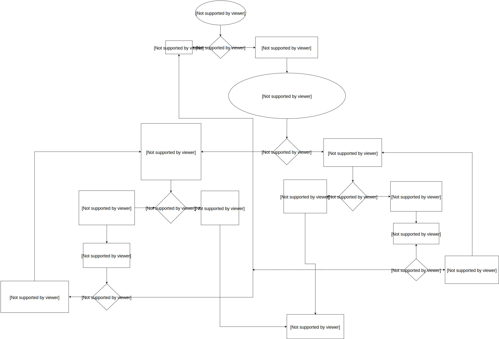

# Introduction

The purpose of this document is to provide a description of the Resource Aware Scheduler for the Storm distributed real-time computation system.  This document will provide you with both a high level description of the resource aware scheduler in Storm

## Using Resource Aware Scheduler

The user can switch to using the Resource Aware Scheduler by setting the following in *conf/storm.yaml*

    storm.scheduler: “org.apache.storm.scheduler.resource.ResourceAwareScheduler”

## API Overview

For use with Trident, please see the [Trident RAS API](Trident-RAS-API.html)

For a Storm Topology, the user can now specify the amount of resources a topology component (i.e. Spout or Bolt) is required to run a single instance of the component.  The user can specify the resource requirement for a topology component by using the following API calls.

### Setting Memory Requirement

API to set component memory requirement:

    public T setMemoryLoad(Number onHeap, Number offHeap)

Parameters:
* Number onHeap – The amount of on heap memory an instance of this component will consume in megabytes
* Number offHeap – The amount of off heap memory an instance of this component will consume in megabytes

The user also has to option to just specify the on heap memory requirement if the component does not have an off heap memory need.

    public T setMemoryLoad(Number onHeap)

Parameters:
* Number onHeap – The amount of on heap memory an instance of this component will consume

If no value is provided for offHeap, 0.0 will be used. If no value is provided for onHeap, or if the API is never called for a component, the default value will be used.

Example of Usage:

    SpoutDeclarer s1 = builder.setSpout("word", new TestWordSpout(), 10);
    s1.setMemoryLoad(1024.0, 512.0);
    builder.setBolt("exclaim1", new ExclamationBolt(), 3)
                .shuffleGrouping("word").setMemoryLoad(512.0);

The entire memory requested for this topology is 16.5 GB. That is from 10 spouts with 1GB on heap memory and 0.5 GB off heap memory each and 3 bolts with 0.5 GB on heap memory each.

### Setting CPU Requirement

API to set component CPU requirement:

    public T setCPULoad(Double amount)

Parameters:
* Number amount – The amount of on CPU an instance of this component will consume.

Currently, the amount of CPU resources a component requires or is available on a node is represented by a point system. CPU usage is a difficult concept to define. Different CPU architectures perform differently depending on the task at hand. They are so complex that expressing all of that in a single precise portable number is impossible. Instead we take a convention over configuration approach and are primarily concerned with rough level of CPU usage while still providing the possibility to specify amounts more fine grained.

By convention a CPU core typically will get 100 points. If you feel that your processors are more or less powerful you can adjust this accordingly. Heavy tasks that are CPU bound will get 100 points, as they can consume an entire core. Medium tasks should get 50, light tasks 25, and tiny tasks 10. In some cases you have a task that spawns other threads to help with processing. These tasks may need to go above 100 points to express the amount of CPU they are using. If these conventions are followed the common case for a single threaded task the reported Capacity * 100 should be the number of CPU points that the task needs.

Example of Usage:

    SpoutDeclarer s1 = builder.setSpout("word", new TestWordSpout(), 10);
    s1.setCPULoad(15.0);
    builder.setBolt("exclaim1", new ExclamationBolt(), 3)
                .shuffleGrouping("word").setCPULoad(10.0);
    builder.setBolt("exclaim2", new HeavyBolt(), 1)
                    .shuffleGrouping("exclaim1").setCPULoad(450.0);

###	Limiting the Heap Size per Worker (JVM) Process

    public void setTopologyWorkerMaxHeapSize(Number size)

Parameters:
* Number size – The memory limit a worker process will be allocated in megabytes

The user can limit the amount of memory resources the resource aware scheduler allocates to a single worker on a per topology basis by using the above API.  This API is in place so that the users can spread executors to multiple workers.  However, spreading executors to multiple workers may increase the communication latency since executors will not be able to use Disruptor Queue for intra-process communication.

Example of Usage:

    Config conf = new Config();
    conf.setTopologyWorkerMaxHeapSize(512.0);

### Setting Available Resources on Node

A storm administrator can specify node resource availability by modifying the *conf/storm.yaml* file located in the storm home directory of that node.

A storm administrator can specify how much available memory a node has in megabytes adding the following to *storm.yaml*

    supervisor.memory.capacity.mb: [amount<Double>]

A storm administrator can also specify how much available CPU resources a node has available adding the following to *storm.yaml*

    supervisor.cpu.capacity: [amount<Double>]

Note: that the amount the user can specify for the available CPU is represented using a point system like discussed earlier.

Example of Usage:

    supervisor.memory.capacity.mb: 20480.0
    supervisor.cpu.capacity: 100.0

### Other Configurations

The user can set some default configurations for the Resource Aware Scheduler in *conf/storm.yaml*:

    //default value if on heap memory requirement is not specified for a component 
    topology.component.resources.onheap.memory.mb: 128.0

    //default value if off heap memory requirement is not specified for a component 
    topology.component.resources.offheap.memory.mb: 0.0

    //default value if CPU requirement is not specified for a component 
    topology.component.cpu.pcore.percent: 10.0

    //default value for the max heap size for a worker  
    topology.worker.max.heap.size.mb: 768.0

# Topology Priorities and Per User Resource 

The Resource Aware Scheduler or RAS also has multitenant capabilities since many Storm users typically share a Storm cluster.  Resource Aware Scheduler can allocate resources on a per user basis.  Each user can be guaranteed a certain amount of resources to run his or her topologies and the Resource Aware Scheduler will meet those guarantees when possible.  When the Storm cluster has extra free resources, Resource Aware Scheduler will to be able allocate additional resources to user in a fair manner. The importance of topologies can also vary.  Topologies can be used for actual production or just experimentation, thus Resource Aware Scheduler will take into account the importance of a topology when determining the order in which to schedule topologies or when to evict topologies

## Setup

The resource guarantees of a user can be specified *conf/user-resource-pools.yaml*.  Specify the resource guarantees of a user in the following format:

    resource.aware.scheduler.user.pools:
	[UserId]
		cpu: [Amount of Guarantee CPU Resources]
		memory: [Amount of Guarantee Memory Resources]

An example of what *user-resource-pools.yaml* can look like:

    resource.aware.scheduler.user.pools:
        jerry:
            cpu: 1000
            memory: 8192.0
        derek:
            cpu: 10000.0
            memory: 32768
        bobby:
            cpu: 5000.0
            memory: 16384.0

Please note that the specified amount of Guaranteed CPU and Memory can be either a integer or double

## API Overview
### Specifying Topology Priority
The range of topology priorities can range form 0-29.  The topologies priorities will be partitioned into several priority levels that may contain a range of priorities. 
For example we can create a priority level mapping:

    PRODUCTION => 0 – 9
    STAGING => 10 – 19
    DEV => 20 – 29

Thus, each priority level contains 10 sub priorities. Users can set the priority level of a topology by using the following API

    conf.setTopologyPriority(int priority)
    
Parameters:
* priority – an integer representing the priority of the topology

Please note that the 0-29 range is not a hard limit.  Thus, a user can set a priority number that is higher than 29. However, the property of higher the priority number, lower the importance still holds

### Specifying Scheduling Strategy:

A user can specify on a per topology basis what scheduling strategy to use.  Users can implement the IStrategy interface and define new strategies to schedule specific topologies.  This pluggable interface was created since we realize different topologies might have different scheduling needs.  A user can set the topology strategy within the topology definition by using the API:

    public void setTopologyStrategy(Class<? extends IStrategy> clazz)
    
Parameters:
* clazz – The strategy class that implements the IStrategy interface

Example Usage:

    conf.setTopologyStrategy(org.apache.storm.scheduler.resource.strategies.scheduling.DefaultResourceAwareStrategy.class);

A default scheduling is provided.  The DefaultResourceAwareStrategy is implemented based off the scheduling algorithm in the original paper describing resource aware scheduling in Storm:

http://web.engr.illinois.edu/~bpeng/files/r-storm.pdf

### Specifying Topology Prioritization Strategy

The order of scheduling is a pluggable interface in which a user could define a strategy that prioritizes topologies.  For a user to define his or her own prioritization strategy, he or she needs to implement the ISchedulingPriorityStrategy interface.  A user can set the scheduling priority strategy by setting the *Config.RESOURCE_AWARE_SCHEDULER_PRIORITY_STRATEGY* to point to the class that implements the strategy. For instance:

    resource.aware.scheduler.priority.strategy: "org.apache.storm.scheduler.resource.strategies.priority.DefaultSchedulingPriorityStrategy"
    
A default strategy will be provided.  The following explains how the default scheduling priority strategy works.

**DefaultSchedulingPriorityStrategy**

The order of scheduling should be based on the distance between a user’s current resource allocation and his or her guaranteed allocation.  We should prioritize the users who are the furthest away from their resource guarantee. The difficulty of this problem is that a user may have multiple resource guarantees, and another user can have another set of resource guarantees, so how can we compare them in a fair manner?  Let's use the average percentage of resource guarantees satisfied as a method of comparison.

For example:

|User|Resource Guarantee|Resource Allocated|
|----|------------------|------------------|
|A|<10 CPU, 50GB>|<2 CPU, 40 GB>|
|B|< 20 CPU, 25GB>|<15 CPU, 10 GB>|

User A’s average percentage satisfied of resource guarantee: 

(2/10+40/50)/2  = 0.5

User B’s average percentage satisfied of resource guarantee: 

(15/20+10/25)/2  = 0.575

Thus, in this example User A has a smaller average percentage of his or her resource guarantee satisfied than User B.  Thus, User A should get priority to be allocated more resource, i.e., schedule a topology submitted by User A.

When scheduling, RAS sorts users by the average percentage satisfied of resource guarantee and schedule topologies from users based on that ordering starting from the users with the lowest average percentage satisfied of resource guarantee.  When a user’s resource guarantee is completely satisfied, the user’s average percentage satisfied of resource guarantee will be greater than or equal to 1.

### Specifying Eviction Strategy
The eviction strategy is used when there are not enough free resources in the cluster to schedule new topologies. If the cluster is full, we need a mechanism to evict topologies so that user resource guarantees can be met and additional resource can be shared fairly among users. The strategy for evicting topologies is also a pluggable interface in which the user can implement his or her own topology eviction strategy.  For a user to implement his or her own eviction strategy, he or she needs to implement the IEvictionStrategy Interface and set *Config.RESOURCE_AWARE_SCHEDULER_EVICTION_STRATEGY* to point to the implemented strategy class. For instance:

    resource.aware.scheduler.eviction.strategy: "org.apache.storm.scheduler.resource.strategies.eviction.DefaultEvictionStrategy"

A default eviction strategy is provided.  The following explains how the default topology eviction strategy works

**DefaultEvictionStrategy**

To determine if topology eviction should occur we should take into account the priority of the topology that we are trying to schedule and whether the resource guarantees for the owner of the topology have been met.  

We should never evict a topology from a user that does not have his or her resource guarantees satisfied.  The following flow chart should describe the logic for the eviction process.

