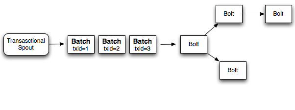
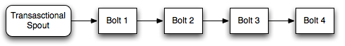
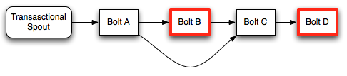
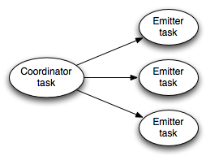

**NOTE**: Transactional topologies have been deprecated -- use the [Trident](Trident-tutorial.html) framework instead.

__________________________________________________________________________

Storm [guarantees data processing](Guaranteeing-message-processing.html) by providing an at least once processing guarantee. The most common question asked about Storm is "Given that tuples can be replayed, how do you do things like counting on top of Storm? Won't you overcount?"

Storm 0.7.0 introduces transactional topologies, which enable you to get exactly once messaging semantics for pretty much any computation. So you can do things like counting in a fully-accurate, scalable, and fault-tolerant way.

Like [Distributed RPC](Distributed-RPC.html), transactional topologies aren't so much a feature of Storm as they are a higher level abstraction built on top of Storm's primitives of streams, spouts, bolts, and topologies.

This page explains the transactional topology abstraction, how to use the API, and provides details as to its implementation.

## Concepts

Let's build up to Storm's abstraction for transactional topologies one step at a time. Let's start by looking at the simplest possible approach, and then we'll iterate on the design until we reach Storm's design.

### Design 1

The core idea behind transactional topologies is to provide a _strong ordering_ on the processing of data. The simplest manifestation of this, and the first design we'll look at, is processing the tuples one at a time and not moving on to the next tuple until the current tuple has been successfully processed by the topology.

Each tuple is associated with a transaction id. If the tuple fails and needs to be replayed, then it is emitted with the exact same transaction id. A transaction id is an integer that increments for every tuple, so the first tuple will have transaction id `1`, the second id `2`, and so on.

The strong ordering of tuples gives you the capability to achieve exactly-once semantics even in the case of tuple replay. Let's look at an example of how you would do this.

Suppose you want to do a global count of the tuples in the stream. Instead of storing just the count in the database, you instead store the count and the latest transaction id together as one value in the database. When your code updates the count in the db, it should update the count *only if the transaction id in the database differs from the transaction id for the tuple currently being processed*. Consider the two cases:

1. *The transaction id in the database is different than the current transaction id:* Because of the strong ordering of transactions, we know for sure that the current tuple isn't represented in that count. So we can safely increment the count and update the transaction id.
2. *The transaction id is the same as the current transaction id:* Then we know that this tuple is already incorporated into the count and can skip the update. The tuple must have failed after updating the database but before reporting success back to Storm.

This logic and the strong ordering of transactions ensures that the count in the database will be accurate even if tuples are replayed.  Credit for this trick of storing a transaction id in the database along with the value goes to the Kafka devs, particularly [this design document](http://incubator.apache.org/kafka/07/design.html).

Furthermore, notice that the topology can safely update many sources of state in the same transaction and achieve exactly-once semantics. If there's a failure, any updates that already succeeded will skip on the retry, and any updates that failed will properly retry. For example, if you were processing a stream of tweeted urls, you could update a database that stores a tweet count for each url as well as a database that stores a tweet count for each domain.

There is a significant problem though with this design of processing one tuple at time. Having to wait for each tuple to be _completely processed_ before moving on to the next one is horribly inefficient. It entails a huge amount of database calls (at least one per tuple), and this design makes very little use of the parallelization capabilities of Storm. So it isn't very scalable.

### Design 2

Instead of processing one tuple at a time, a better approach is to process a batch of tuples for each transaction. So if you're doing a global count, you would increment the count by the number of tuples in the entire batch. If a batch fails, you replay the exact batch that failed. Instead of assigning a transaction id to each tuple, you assign a transaction id to each batch, and the processing of the batches is strongly ordered. Here's a diagram of this design:



So if you're processing 1000 tuples per batch, your application will do 1000x less database operations than design 1. Additionally, it takes advantage of Storm's parallelization capabilities as the computation for each batch can be parallelized.

While this design is significantly better than design 1, it's still not as resource-efficient as possible. The workers in the topology spend a lot of time being idle waiting for the other portions of the computation to finish. For example, in a topology like this:



After bolt 1 finishes its portion of the processing, it will be idle until the rest of the bolts finish and the next batch can be emitted from the spout.

### Design 3 (Storm's design)

A key realization is that not all the work for processing batches of tuples needs to be strongly ordered. For example, when computing a global count, there's two parts to the computation:

1. Computing the partial count for the batch
2. Updating the global count in the database with the partial count

The computation of #2 needs to be strongly ordered across the batches, but there's no reason you shouldn't be able to _pipeline_ the computation of the batches by computing #1 for many batches in parallel. So while batch 1 is working on updating the database, batches 2 through 10 can compute their partial counts.

Storm accomplishes this distinction by breaking the computation of a batch into two phases:

1. The processing phase: this is the phase that can be done in parallel for many batches
2. The commit phase: The commit phases for batches are strongly ordered. So the commit for batch 2 is not done until the commit for batch 1 has been successful.

The two phases together are called a "transaction". Many batches can be in the processing phase at a given moment, but only one batch can be in the commit phase. If there's any failure in the processing or commit phase for a batch, the entire transaction is replayed (both phases).

## Design details

When using transactional topologies, Storm does the following for you:

1. *Manages state:* Storm stores in Zookeeper all the state necessary to do transactional topologies. This includes the current transaction id as well as the metadata defining the parameters for each batch.
2. *Coordinates the transactions:* Storm will manage everything necessary to determine which transactions should be processing or committing at any point.
3. *Fault detection:* Storm leverages the acking framework to efficiently determine when a batch has successfully processed, successfully committed, or failed. Storm will then replay batches appropriately. You don't have to do any acking or anchoring -- Storm manages all of this for you.
4. *First class batch processing API*: Storm layers an API on top of regular bolts to allow for batch processing of tuples. Storm manages all the coordination for determining when a task has received all the tuples for that particular transaction. Storm will also take care of cleaning up any accumulated state for each transaction (like the partial counts).

Finally, another thing to note is that transactional topologies require a source queue that can replay an exact batch of messages. Technologies like [Kestrel](https://github.com/robey/kestrel) can't do this. [Apache Kafka](http://incubator.apache.org/kafka/index.html) is a perfect fit for this kind of spout, and [storm-kafka](https://github.com/apache/storm/tree/master/external/storm-kafka) contains a transactional spout implementation for Kafka.

## The basics through example

You build transactional topologies by using [TransactionalTopologyBuilder](javadocs/backtype/storm/transactional/TransactionalTopologyBuilder.html). Here's the transactional topology definition for a topology that computes the global count of tuples from the input stream. This code comes from [TransactionalGlobalCount]({{page.git-blob-base}}/examples/storm-starter/src/jvm/storm/starter/TransactionalGlobalCount.java) in storm-starter.

```java
MemoryTransactionalSpout spout = new MemoryTransactionalSpout(DATA, new Fields("word"), PARTITION_TAKE_PER_BATCH);
TransactionalTopologyBuilder builder = new TransactionalTopologyBuilder("global-count", "spout", spout, 3);
builder.setBolt("partial-count", new BatchCount(), 5)
        .shuffleGrouping("spout");
builder.setBolt("sum", new UpdateGlobalCount())
        .globalGrouping("partial-count");
```

`TransactionalTopologyBuilder` takes as input in the constructor an id for the transactional topology, an id for the spout within the topology, a transactional spout, and optionally the parallelism for the transactional spout. The id for the transactional topology is used to store state about the progress of topology in Zookeeper, so that if you restart the topology it will continue where it left off.

A transactional topology has a single `TransactionalSpout` that is defined in the constructor of `TransactionalTopologyBuilder`. In this example, `MemoryTransactionalSpout` is used which reads in data from an in-memory partitioned source of data (the `DATA` variable). The second argument defines the fields for the data, and the third argument specifies the maximum number of tuples to emit from each partition per batch of tuples. The interface for defining your own transactional spouts is discussed later on in this tutorial.

Now on to the bolts. This topology parallelizes the computation of the global count. The first bolt, `BatchCount`, randomly partitions the input stream using a shuffle grouping and emits the count for each partition. The second bolt, `UpdateGlobalCount`, does a global grouping and sums together the partial counts to get the count for the batch. It then updates the global count in the database if necessary.

Here's the definition of `BatchCount`:

```java
public static class BatchCount extends BaseBatchBolt {
    Object _id;
    BatchOutputCollector _collector;

    int _count = 0;

    @Override
    public void prepare(Map conf, TopologyContext context, BatchOutputCollector collector, Object id) {
        _collector = collector;
        _id = id;
    }

    @Override
    public void execute(Tuple tuple) {
        _count++;
    }

    @Override
    public void finishBatch() {
        _collector.emit(new Values(_id, _count));
    }

    @Override
    public void declareOutputFields(OutputFieldsDeclarer declarer) {
        declarer.declare(new Fields("id", "count"));
    }
}
```

A new instance of this object is created for every batch that's being processed. The actual bolt this runs within is called [BatchBoltExecutor](https://github.com/apache/storm/blob/0.7.0/src/jvm/backtype/storm/coordination/BatchBoltExecutor.java) and manages the creation and cleanup for these objects.

The `prepare` method parameterizes this batch bolt with the Storm config, the topology context, an output collector, and the id for this batch of tuples. In the case of transactional topologies, the id will be a [TransactionAttempt](javadocs/backtype/storm/transactional/TransactionAttempt.html) object. The batch bolt abstraction can be used in Distributed RPC as well which uses a different type of id for the batches. `BatchBolt` can actually be parameterized with the type of the id, so if you only intend to use the batch bolt for transactional topologies, you can extend `BaseTransactionalBolt` which has this definition:

```java
public abstract class BaseTransactionalBolt extends BaseBatchBolt<TransactionAttempt> {
}
```

All tuples emitted within a transactional topology must have the `TransactionAttempt` as the first field of the tuple. This lets Storm identify which tuples belong to which batches. So when you emit tuples you need to make sure to meet this requirement.

The `TransactionAttempt` contains two values: the "transaction id" and the "attempt id". The "transaction id" is the unique id chosen for this batch and is the same no matter how many times the batch is replayed. The "attempt id" is a unique id for this particular batch of tuples and lets Storm distinguish tuples from different emissions of the same batch. Without the attempt id, Storm could confuse a replay of a batch with tuples from a prior time that batch was emitted. This would be disastrous.

The transaction id increases by 1 for every batch emitted. So the first batch has id "1", the second has id "2", and so on.

The `execute` method is called for every tuple in the batch. You should accumulate state for the batch in a local instance variable every time this method is called. The `BatchCount` bolt increments a local counter variable for every tuple.

Finally, `finishBatch` is called when the task has received all tuples intended for it for this particular batch. `BatchCount` emits the partial count to the output stream when this method is called.

Here's the definition of `UpdateGlobalCount`:

```java
public static class UpdateGlobalCount extends BaseTransactionalBolt implements ICommitter {
    TransactionAttempt _attempt;
    BatchOutputCollector _collector;

    int _sum = 0;

    @Override
    public void prepare(Map conf, TopologyContext context, BatchOutputCollector collector, TransactionAttempt attempt) {
        _collector = collector;
        _attempt = attempt;
    }

    @Override
    public void execute(Tuple tuple) {
        _sum+=tuple.getInteger(1);
    }

    @Override
    public void finishBatch() {
        Value val = DATABASE.get(GLOBAL_COUNT_KEY);
        Value newval;
        if(val == null || !val.txid.equals(_attempt.getTransactionId())) {
            newval = new Value();
            newval.txid = _attempt.getTransactionId();
            if(val==null) {
                newval.count = _sum;
            } else {
                newval.count = _sum + val.count;
            }
            DATABASE.put(GLOBAL_COUNT_KEY, newval);
        } else {
            newval = val;
        }
        _collector.emit(new Values(_attempt, newval.count));
    }

    @Override
    public void declareOutputFields(OutputFieldsDeclarer declarer) {
        declarer.declare(new Fields("id", "sum"));
    }
}
```

`UpdateGlobalCount` is specific to transactional topologies so it extends `BaseTransactionalBolt`. In the `execute` method, `UpdateGlobalCount` accumulates the count for this batch by summing together the partial batches. The interesting stuff happens in `finishBatch`.

First, notice that this bolt implements the `ICommitter` interface. This tells Storm that the `finishBatch` method of this bolt should be part of the commit phase of the transaction. So calls to `finishBatch` for this bolt will be strongly ordered by transaction id (calls to `execute` on the other hand can happen during either the processing or commit phases). An alternative way to mark a bolt as a committer is to use the `setCommitterBolt` method in `TransactionalTopologyBuilder` instead of `setBolt`.

The code for `finishBatch` in `UpdateGlobalCount` gets the current value from the database and compares its transaction id to the transaction id for this batch. If they are the same, it does nothing. Otherwise, it increments the value in the database by the partial count for this batch.

A more involved transactional topology example that updates multiple databases idempotently can be found in storm-starter in the [TransactionalWords]({{page.git-blob-base}}/examples/storm-starter/src/jvm/storm/starter/TransactionalWords.java) class.

## Transactional Topology API

This section outlines the different pieces of the transactional topology API.

### Bolts

There are three kinds of bolts possible in a transactional topology:

1. [BasicBolt](javadocs/backtype/storm/topology/base/BaseBasicBolt.html): This bolt doesn't deal with batches of tuples and just emits tuples based on a single tuple of input.
2. [BatchBolt](javadocs/backtype/storm/topology/base/BaseBatchBolt.html): This bolt processes batches of tuples. `execute` is called for each tuple, and `finishBatch` is called when the batch is complete.
3. BatchBolt's that are marked as committers: The only difference between this bolt and a regular batch bolt is when `finishBatch` is called. A committer bolt has `finishedBatch` called during the commit phase. The commit phase is guaranteed to occur only after all prior batches have successfully committed, and it will be retried until all bolts in the topology succeed the commit for the batch. There are two ways to make a `BatchBolt` a committer, by having the `BatchBolt` implement the [ICommitter](javadocs/backtype/storm/transactional/ICommitter.html) marker interface, or by using the `setCommiterBolt` method in `TransactionalTopologyBuilder`.

#### Processing phase vs. commit phase in bolts

To nail down the difference between the processing phase and commit phase of a transaction, let's look at an example topology:



In this topology, only the bolts with a red outline are committers.

During the processing phase, bolt A will process the complete batch from the spout, call `finishBatch` and send its tuples to bolts B and C. Bolt B is a committer so it will process all the tuples but finishBatch won't be called. Bolt C also will not have `finishBatch` called because it doesn't know if it has received all the tuples from Bolt B yet (because Bolt B is waiting for the transaction to commit). Finally, Bolt D will receive any tuples Bolt C emitted during invocations of its `execute` method.

When the batch commits, `finishBatch` is called on Bolt B. Once it finishes, Bolt C can now detect that it has received all the tuples and will call `finishBatch`. Finally, Bolt D will receive its complete batch and call `finishBatch`.

Notice that even though Bolt D is a committer, it doesn't have to wait for a second commit message when it receives the whole batch. Since it receives the whole batch during the commit phase, it goes ahead and completes the transaction.

Committer bolts act just like batch bolts during the commit phase. The only difference between committer bolts and batch bolts is that committer bolts will not call `finishBatch` during the processing phase of a transaction.

#### Acking

Notice that you don't have to do any acking or anchoring when working with transactional topologies. Storm manages all of that underneath the hood. The acking strategy is heavily optimized.

#### Failing a transaction

When using regular bolts, you can call the `fail` method on `OutputCollector` to fail the tuple trees of which that tuple is a member. Since transactional topologies hide the acking framework from you, they provide a different mechanism to fail a batch (and cause the batch to be replayed). Just throw a [FailedException](javadocs/backtype/storm/topology/FailedException.html). Unlike regular exceptions, this will only cause that particular batch to replay and will not crash the process.

### Transactional spout

The `TransactionalSpout` interface is completely different from a regular `Spout` interface. A `TransactionalSpout` implementation emits batches of tuples and must ensure that the same batch of tuples is always emitted for the same transaction id.

A transactional spout looks like this while a topology is executing:



The coordinator on the left is a regular Storm spout that emits a tuple whenever a batch should be emitted for a transaction. The emitters execute as a regular Storm bolt and are responsible for emitting the actual tuples for the batch. The emitters subscribe to the "batch emit" stream of the coordinator using an all grouping.

The need to be idempotent with respect to the tuples it emits requires a `TransactionalSpout` to store a small amount of state. The state is stored in Zookeeper.

The details of implementing a `TransactionalSpout` are in [the Javadoc](javadocs/backtype/storm/transactional/ITransactionalSpout.html).

#### Partitioned Transactional Spout

A common kind of transactional spout is one that reads the batches from a set of partitions across many queue brokers. For example, this is how [TransactionalKafkaSpout]({{page.git-tree-base}}/external/storm-kafka/src/jvm/storm/kafka/TransactionalKafkaSpout.java) works. An `IPartitionedTransactionalSpout` automates the bookkeeping work of managing the state for each partition to ensure idempotent replayability. See [the Javadoc](javadocs/backtype/storm/transactional/partitioned/IPartitionedTransactionalSpout.html) for more details.

### Configuration

There's two important bits of configuration for transactional topologies:

1. *Zookeeper:* By default, transactional topologies will store state in the same Zookeeper instance as used to manage the Storm cluster. You can override this with the "transactional.zookeeper.servers" and "transactional.zookeeper.port" configs.
2. *Number of active batches permissible at once:* You must set a limit to the number of batches that can be processed at once. You configure this using the "topology.max.spout.pending" config. If you don't set this config, it will default to 1.

## What if you can't emit the same batch of tuples for a given transaction id?

So far the discussion around transactional topologies has assumed that you can always emit the exact same batch of tuples for the same transaction id. So what do you do if this is not possible?

Consider an example of when this is not possible. Suppose you are reading tuples from a partitioned message broker (stream is partitioned across many machines), and a single transaction will include tuples from all the individual machines. Now suppose one of the nodes goes down at the same time that a transaction fails. Without that node, it is impossible to replay the same batch of tuples you just played for that transaction id. The processing in your topology will halt as its unable to replay the identical batch. The only possible solution is to emit a different batch for that transaction id than you emitted before. Is it possible to still achieve exactly-once messaging semantics even if the batches change?

It turns out that you can still achieve exactly-once messaging semantics in your processing with a non-idempotent transactional spout, although this requires a bit more work on your part in developing the topology.

If a batch can change for a given transaction id, then the logic we've been using so far of "skip the update if the transaction id in the database is the same as the id for the current transaction" is no longer valid. This is because the current batch is different than the batch for the last time the transaction was committed, so the result will not necessarily be the same. You can fix this problem by storing a little bit more state in the database. Let's again use the example of storing a global count in the database and suppose the partial count for the batch is stored in the `partialCount` variable.

Instead of storing a value in the database that looks like this:

```java
class Value {
  Object count;
  BigInteger txid;
}
```

For non-idempotent transactional spouts you should instead store a value that looks like this:

```java
class Value {
  Object count;
  BigInteger txid;
  Object prevCount;
}
```

The logic for the update is as follows:

1. If the transaction id for the current batch is the same as the transaction id in the database, set `val.count = val.prevCount + partialCount`.
2. Otherwise, set `val.prevCount = val.count`, `val.count = val.count + partialCount` and `val.txid = batchTxid`.

This logic works because once you commit a particular transaction id for the first time, all prior transaction ids will never be committed again.

There's a few more subtle aspects of transactional topologies that make opaque transactional spouts possible.

When a transaction fails, all subsequent transactions in the processing phase are considered failed as well. Each of those transactions will be re-emitted and reprocessed. Without this behavior, the following situation could happen:

1. Transaction A emits tuples 1-50
2. Transaction B emits tuples 51-100
3. Transaction A fails
4. Transaction A emits tuples 1-40
5. Transaction A commits
6. Transaction B commits
7. Transaction C emits tuples 101-150

In this scenario, tuples 41-50 are skipped. By failing all subsequent transactions, this would happen instead:

1. Transaction A emits tuples 1-50
2. Transaction B emits tuples 51-100
3. Transaction A fails (and causes Transaction B to fail)
4. Transaction A emits tuples 1-40
5. Transaction B emits tuples 41-90
5. Transaction A commits
6. Transaction B commits
7. Transaction C emits tuples 91-140

By failing all subsequent transactions on failure, no tuples are skipped. This also shows that a requirement of transactional spouts is that they always emit where the last transaction left off.

A non-idempotent transactional spout is more concisely referred to as an "OpaqueTransactionalSpout" (opaque is the opposite of idempotent). [IOpaquePartitionedTransactionalSpout](javadocs/backtype/storm/transactional/partitioned/IOpaquePartitionedTransactionalSpout.html) is an interface for implementing opaque partitioned transactional spouts, of which [OpaqueTransactionalKafkaSpout]({{page.git-tree-base}}/external/storm-kafka/src/jvm/storm/kafka/OpaqueTransactionalKafkaSpout.java) is an example. `OpaqueTransactionalKafkaSpout` can withstand losing individual Kafka nodes without sacrificing accuracy as long as you use the update strategy as explained in this section.

## Implementation

The implementation for transactional topologies is very elegant. Managing the commit protocol, detecting failures, and pipelining batches seem complex, but everything turns out to be a straightforward mapping to Storm's primitives.

How the data flow works:

Here's how transactional spout works:

1. Transactional spout is a subtopology consisting of a coordinator spout and an emitter bolt
2. The coordinator is a regular spout with a parallelism of 1
3. The emitter is a bolt with a parallelism of P, connected to the coordinator's "batch" stream using an all grouping
4. When the coordinator determines it's time to enter the processing phase for a transaction, it emits a tuple containing the TransactionAttempt and the metadata for that transaction to the "batch" stream
5. Because of the all grouping, every single emitter task receives the notification that it's time to emit its portion of the tuples for that transaction attempt
6. Storm automatically manages the anchoring/acking necessary throughout the whole topology to determine when a transaction has completed the processing phase. The key here is that *the root tuple was created by the coordinator, so the coordinator will receive an "ack" if the processing phase succeeds, and a "fail" if it doesn't succeed for any reason (failure or timeout).
7. If the processing phase succeeds, and all prior transactions have successfully committed, the coordinator emits a tuple containing the TransactionAttempt to the "commit" stream.
8. All committing bolts subscribe to the commit stream using an all grouping, so that they will all receive a notification when the commit happens.
9. Like the processing phase, the coordinator uses the acking framework to determine whether the commit phase succeeded or not. If it receives an "ack", it marks that transaction as complete in zookeeper.

More notes:

- Transactional spouts are a sub-topology consisting of a spout and a bolt
  - the spout is the coordinator and contains a single task
  - the bolt is the emitter
  - the bolt subscribes to the coordinator with an all grouping
  - serialization of metadata is handled by kryo. kryo is initialized ONLY with the registrations defined in the component configuration for the transactionalspout
- the coordinator uses the acking framework to determine when a batch has been successfully processed, and then to determine when a batch has been successfully committed.
- state is stored in zookeeper using RotatingTransactionalState
- commiting bolts subscribe to the coordinators commit stream using an all grouping
- CoordinatedBolt is used to detect when a bolt has received all the tuples for a particular batch.
  - this is the same abstraction that is used in DRPC
  - for commiting bolts, it waits to receive a tuple from the coordinator's commit stream before calling finishbatch
  - so it can't call finishbatch until it's received all tuples from all subscribed components AND its received the commit stream tuple (for committers). this ensures that it can't prematurely call finishBatch
