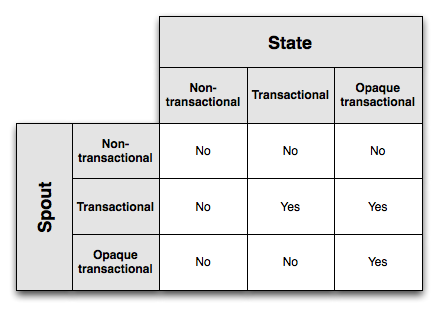

Trident has first-class abstractions for reading from and writing to stateful sources. The state can either be internal to the topology – e.g., kept in-memory and backed by HDFS – or externally stored in a database like Memcached or Cassandra. There's no difference in the Trident API for either case.

Trident manages state in a fault-tolerant way so that state updates are idempotent in the face of retries and failures. This lets you reason about Trident topologies as if each message were processed exactly-once.

There's various levels of fault-tolerance possible when doing state updates. Before getting to those, let's look at an example that illustrates the tricks necessary to achieve exactly-once semantics. Suppose that you're doing a count aggregation of your stream and want to store the running count in a database. Now suppose you store in the database a single value representing the count, and every time you process a new tuple you increment the count.

When failures occur, tuples will be replayed. This brings up a problem when doing state updates (or anything with side effects) – you have no idea if you've ever successfully updated the state based on this tuple before. Perhaps you never processed the tuple before, in which case you should increment the count. Perhaps you've processed the tuple and successfully incremented the count, but the tuple failed processing in another step. In this case, you should not increment the count. Or perhaps you saw the tuple before but got an error when updating the database. In this case, you *should* update the database.

By just storing the count in the database, you have no idea whether or not this tuple has been processed before. So you need more information in order to make the right decision. Trident provides the following semantics which are sufficient for achieving exactly-once processing semantics:

1. Tuples are processed as small batches (see [the tutorial](Trident-tutorial.html))
2. Each batch of tuples is given a unique id called the "transaction id" (txid). If the batch is replayed, it is given the exact same txid.
3. State updates are ordered among batches. That is, the state updates for batch 3 won't be applied until the state updates for batch 2 have succeeded.

With these primitives, your State implementation can detect whether or not the batch of tuples has been processed before and take the appropriate action to update the state in a consistent way. The action you take depends on the exact semantics provided by your input spouts as to what's in each batch. There's three kinds of spouts possible with respect to fault-tolerance: "non-transactional", "transactional", and "opaque transactional". Likewise, there's three kinds of state possible with respect to fault-tolerance: "non-transactional", "transactional", and "opaque transactional". Let's take a look at each spout type and see what kind of fault-tolerance you can achieve with each.

## Transactional spouts

Remember, Trident processes tuples as small batches with each batch being given a unique transaction id. The properties of spouts vary according to the guarantees they can provide as to what's in each batch. A transactional spout has the following properties:

1. Batches for a given txid are always the same. Replays of batches for a txid will exact same set of tuples as the first time that batch was emitted for that txid.
2. There's no overlap between batches of tuples (tuples are in one batch or another, never multiple).
3. Every tuple is in a batch (no tuples are skipped)

This is a pretty easy type of spout to understand, the stream is divided into fixed batches that never change. storm-contrib has [an implementation of a transactional spout]({{page.git-tree-base}}/external/storm-kafka/src/jvm/storm/kafka/trident/TransactionalTridentKafkaSpout.java) for Kafka.

You might be wondering – why wouldn't you just always use a transactional spout? They're simple and easy to understand. One reason you might not use one is because they're not necessarily very fault-tolerant. For example, the way TransactionalTridentKafkaSpout works is the batch for a txid will contain tuples from all the Kafka partitions for a topic. Once a batch has been emitted, any time that batch is re-emitted in the future the exact same set of tuples must be emitted to meet the semantics of transactional spouts. Now suppose a batch is emitted from TransactionalTridentKafkaSpout, the batch fails to process, and at the same time one of the Kafka nodes goes down. You're now incapable of replaying the same batch as you did before (since the node is down and some partitions for the topic are not unavailable), and processing will halt. 

This is why "opaque transactional" spouts exist – they are fault-tolerant to losing source nodes while still allowing you to achieve exactly-once processing semantics. We'll cover those spouts in the next section though.

(One side note – once Kafka supports replication, it will be possible to have transactional spouts that are fault-tolerant to node failure, but that feature does not exist yet.)

Before we get to "opaque transactional" spouts, let's look at how you would design a State implementation that has exactly-once semantics for transactional spouts. This State type is called a "transactional state" and takes advantage of the fact that any given txid is always associated with the exact same set of tuples.

Suppose your topology computes word count and you want to store the word counts in a key/value database. The key will be the word, and the value will contain the count. You've already seen that storing just the count as the value isn't sufficient to know whether you've processed a batch of tuples before. Instead, what you can do is store the transaction id with the count in the database as an atomic value. Then, when updating the count, you can just compare the transaction id in the database with the transaction id for the current batch. If they're the same, you skip the update – because of the strong ordering, you know for sure that the value in the database incorporates the current batch. If they're different, you increment the count. This logic works because the batch for a txid never changes, and Trident ensures that state updates are ordered among batches.

Consider this example of why it works. Suppose you are processing txid 3 which consists of the following batch of tuples:

```
["man"]
["man"]
["dog"]
```

Suppose the database currently holds the following key/value pairs:

```
man => [count=3, txid=1]
dog => [count=4, txid=3]
apple => [count=10, txid=2]
```

The txid associated with "man" is txid 1. Since the current txid is 3, you know for sure that this batch of tuples is not represented in that count. So you can go ahead and increment the count by 2 and update the txid. On the other hand, the txid for "dog" is the same as the current txid. So you know for sure that the increment from the current batch is already represented in the database for the "dog" key. So you can skip the update. After completing updates, the database looks like this:

```
man => [count=5, txid=3]
dog => [count=4, txid=3]
apple => [count=10, txid=2]
```

Let's now look at opaque transactional spouts and how to design states for that type of spout.

## Opaque transactional spouts

As described before, an opaque transactional spout cannot guarantee that the batch of tuples for a txid remains constant. An opaque transactional spout has the following property:

1. Every tuple is *successfully* processed in exactly one batch. However, it's possible for a tuple to fail to process in one batch and then succeed to process in a later batch.

[OpaqueTridentKafkaSpout]({{page.git-tree-base}}/external/storm-kafka/src/jvm/storm/kafka/trident/OpaqueTridentKafkaSpout.java) is a spout that has this property and is fault-tolerant to losing Kafka nodes. Whenever it's time for OpaqueTridentKafkaSpout to emit a batch, it emits tuples starting from where the last batch finished emitting. This ensures that no tuple is ever skipped or successfully processed by multiple batches.

With opaque transactional spouts, it's no longer possible to use the trick of skipping state updates if the transaction id in the database is the same as the transaction id for the current batch. This is because the batch may have changed between state updates.

What you can do is store more state in the database. Rather than store a value and transaction id in the database, you instead store a value, transaction id, and the previous value in the database. Let's again use the example of storing a count in the database. Suppose the partial count for your batch is "2" and it's time to apply a state update. Suppose the value in the database looks like this:

```
{ value = 4,
  prevValue = 1,
  txid = 2
}
```

Suppose your current txid is 3, different than what's in the database. In this case, you set "prevValue" equal to "value", increment "value" by your partial count, and update the txid. The new database value will look like this:

```
{ value = 6,
  prevValue = 4,
  txid = 3
}
```

Now suppose your current txid is 2, equal to what's in the database. Now you know that the "value" in the database contains an update from a previous batch for your current txid, but that batch may have been different so you have to ignore it. What you do in this case is increment "prevValue" by your partial count to compute the new "value". You then set the value in the database to this:

```
{ value = 3,
  prevValue = 1,
  txid = 2
}
```

This works because of the strong ordering of batches provided by Trident. Once Trident moves onto a new batch for state updates, it will never go back to a previous batch. And since opaque transactional spouts guarantee no overlap between batches – that each tuple is successfully processed by one batch – you can safely update based on the previous value.

## Non-transactional spouts

Non-transactional spouts don't provide any guarantees about what's in each batch. So it might have at-most-once processing, in which case tuples are not retried after failed batches. Or it might have at-least-once processing, where tuples can be processed successfully by multiple batches. There's no way to achieve exactly-once semantics for this kind of spout.

## Summary of spout and state types

This diagram shows which combinations of spouts / states enable exactly-once messaging semantics:



Opaque transactional states have the strongest fault-tolerance, but this comes at the cost of needing to store the txid and two values in the database. Transactional states require less state in the database, but only work with transactional spouts. Finally, non-transactional states require the least state in the database but cannot achieve exactly-once semantics.

The state and spout types you choose are a tradeoff between fault-tolerance and storage costs, and ultimately your application requirements will determine which combination is right for you.

## State APIs

You've seen the intricacies of what it takes to achieve exactly-once semantics. The nice thing about Trident is that it internalizes all the fault-tolerance logic within the State – as a user you don't have to deal with comparing txids, storing multiple values in the database, or anything like that. You can write code like this:

```java
TridentTopology topology = new TridentTopology();        
TridentState wordCounts =
      topology.newStream("spout1", spout)
        .each(new Fields("sentence"), new Split(), new Fields("word"))
        .groupBy(new Fields("word"))
        .persistentAggregate(MemcachedState.opaque(serverLocations), new Count(), new Fields("count"))                
        .parallelismHint(6);
```

All the logic necessary to manage opaque transactional state logic is internalized in the MemcachedState.opaque call. Additionally, updates are automatically batched to minimize roundtrips to the database.

The base State interface just has two methods:

```java
public interface State {
    void beginCommit(Long txid); // can be null for things like partitionPersist occurring off a DRPC stream
    void commit(Long txid);
}
```

You're told when a state update is beginning, when a state update is ending, and you're given the txid in each case. Trident assumes nothing about how your state works, what kind of methods there are to update it, and what kind of methods there are to read from it.

Suppose you have a home-grown database that contains user location information and you want to be able to access it from Trident. Your State implementation would have methods for getting and setting user information:

```java
public class LocationDB implements State {
    public void beginCommit(Long txid) {    
    }
    
    public void commit(Long txid) {    
    }
    
    public void setLocation(long userId, String location) {
      // code to access database and set location
    }
    
    public String getLocation(long userId) {
      // code to get location from database
    }
}
```

You then provide Trident a StateFactory that can create instances of your State object within Trident tasks. The StateFactory for your LocationDB might look something like this:

```java
public class LocationDBFactory implements StateFactory {
   public State makeState(Map conf, int partitionIndex, int numPartitions) {
      return new LocationDB();
   } 
}
```

Trident provides the QueryFunction interface for writing Trident operations that query a source of state, and the StateUpdater interface for writing Trident operations that update a source of state. For example, let's write an operation "QueryLocation" that queries the LocationDB for the locations of users. Let's start off with how you would use it in a topology. Let's say this topology consumes an input stream of userids:

```java
TridentTopology topology = new TridentTopology();
TridentState locations = topology.newStaticState(new LocationDBFactory());
topology.newStream("myspout", spout)
        .stateQuery(locations, new Fields("userid"), new QueryLocation(), new Fields("location"))
```

Now let's take a look at what the implementation of QueryLocation would look like:

```java
public class QueryLocation extends BaseQueryFunction<LocationDB, String> {
    public List<String> batchRetrieve(LocationDB state, List<TridentTuple> inputs) {
        List<String> ret = new ArrayList();
        for(TridentTuple input: inputs) {
            ret.add(state.getLocation(input.getLong(0)));
        }
        return ret;
    }

    public void execute(TridentTuple tuple, String location, TridentCollector collector) {
        collector.emit(new Values(location));
    }    
}
```

QueryFunction's execute in two steps. First, Trident collects a batch of reads together and passes them to batchRetrieve. In this case, batchRetrieve will receive multiple user ids. batchRetrieve is expected to return a list of results that's the same size as the list of input tuples. The first element of the result list corresponds to the result for the first input tuple, the second is the result for the second input tuple, and so on.

You can see that this code doesn't take advantage of the batching that Trident does, since it just queries the LocationDB one at a time. So a better way to write the LocationDB would be like this:

```java
public class LocationDB implements State {
    public void beginCommit(Long txid) {    
    }
    
    public void commit(Long txid) {    
    }
    
    public void setLocationsBulk(List<Long> userIds, List<String> locations) {
      // set locations in bulk
    }
    
    public List<String> bulkGetLocations(List<Long> userIds) {
      // get locations in bulk
    }
}
```

Then, you can write the QueryLocation function like this:

```java
public class QueryLocation extends BaseQueryFunction<LocationDB, String> {
    public List<String> batchRetrieve(LocationDB state, List<TridentTuple> inputs) {
        List<Long> userIds = new ArrayList<Long>();
        for(TridentTuple input: inputs) {
            userIds.add(input.getLong(0));
        }
        return state.bulkGetLocations(userIds);
    }

    public void execute(TridentTuple tuple, String location, TridentCollector collector) {
        collector.emit(new Values(location));
    }    
}
```

This code will be much more efficient by reducing roundtrips to the database. 

To update state, you make use of the StateUpdater interface. Here's a StateUpdater that updates a LocationDB with new location information:

```java
public class LocationUpdater extends BaseStateUpdater<LocationDB> {
    public void updateState(LocationDB state, List<TridentTuple> tuples, TridentCollector collector) {
        List<Long> ids = new ArrayList<Long>();
        List<String> locations = new ArrayList<String>();
        for(TridentTuple t: tuples) {
            ids.add(t.getLong(0));
            locations.add(t.getString(1));
        }
        state.setLocationsBulk(ids, locations);
    }
}
```

Here's how you would use this operation in a Trident topology:

```java
TridentTopology topology = new TridentTopology();
TridentState locations = 
    topology.newStream("locations", locationsSpout)
        .partitionPersist(new LocationDBFactory(), new Fields("userid", "location"), new LocationUpdater())
```

The partitionPersist operation updates a source of state. The StateUpdater receives the State and a batch of tuples with updates to that State. This code just grabs the userids and locations from the input tuples and does a bulk set into the State. 

partitionPersist returns a TridentState object representing the location db being updated by the Trident topology. You could then use this state in stateQuery operations elsewhere in the topology. 

You can also see that StateUpdaters are given a TridentCollector. Tuples emitted to this collector go to the "new values stream". In this case, there's nothing interesting to emit to that stream, but if you were doing something like updating counts in a database, you could emit the updated counts to that stream. You can then get access to the new values stream for further processing via the TridentState#newValuesStream method.

## persistentAggregate

Trident has another method for updating States called persistentAggregate. You've seen this used in the streaming word count example, shown again below:

```java
TridentTopology topology = new TridentTopology();        
TridentState wordCounts =
      topology.newStream("spout1", spout)
        .each(new Fields("sentence"), new Split(), new Fields("word"))
        .groupBy(new Fields("word"))
        .persistentAggregate(new MemoryMapState.Factory(), new Count(), new Fields("count"))
```

persistentAggregate is an additional abstraction built on top of partitionPersist that knows how to take a Trident aggregator and use it to apply updates to the source of state. In this case, since this is a grouped stream, Trident expects the state you provide to implement the "MapState" interface. The grouping fields will be the keys in the state, and the aggregation result will be the values in the state. The "MapState" interface looks like this:

```java
public interface MapState<T> extends State {
    List<T> multiGet(List<List<Object>> keys);
    List<T> multiUpdate(List<List<Object>> keys, List<ValueUpdater> updaters);
    void multiPut(List<List<Object>> keys, List<T> vals);
}
```

When you do aggregations on non-grouped streams (a global aggregation), Trident expects your State object to implement the "Snapshottable" interface:

```java
public interface Snapshottable<T> extends State {
    T get();
    T update(ValueUpdater updater);
    void set(T o);
}
```

[MemoryMapState]({{page.git-blob-base}}/storm-core/src/jvm/storm/trident/testing/MemoryMapState.java) and [MemcachedState](https://github.com/nathanmarz/trident-memcached/blob/{{page.version}}/src/jvm/trident/memcached/MemcachedState.java) each implement both of these interfaces.

## Implementing Map States

Trident makes it easy to implement MapState's, doing almost all the work for you. The OpaqueMap, TransactionalMap, and NonTransactionalMap classes implement all the logic for doing the respective fault-tolerance logic. You simply provide these classes with an IBackingMap implementation that knows how to do multiGets and multiPuts of the respective key/values. IBackingMap looks like this:

```java
public interface IBackingMap<T> {
    List<T> multiGet(List<List<Object>> keys); 
    void multiPut(List<List<Object>> keys, List<T> vals); 
}
```

OpaqueMap's will call multiPut with [OpaqueValue]({{page.git-blob-base}}/storm-core/src/jvm/storm/trident/state/OpaqueValue.java)'s for the vals, TransactionalMap's will give [TransactionalValue]({{page.git-blob-base}}/storm-core/src/jvm/storm/trident/state/TransactionalValue.java)'s for the vals, and NonTransactionalMaps will just pass the objects from the topology through.

Trident also provides the [CachedMap]({{page.git-blob-base}}/storm-core/src/jvm/storm/trident/state/map/CachedMap.java) class to do automatic LRU caching of map key/vals.

Finally, Trident provides the [SnapshottableMap]({{page.git-blob-base}}/storm-core/src/jvm/storm/trident/state/map/SnapshottableMap.java) class that turns a MapState into a Snapshottable object, by storing global aggregations into a fixed key.

Take a look at the implementation of [MemcachedState](https://github.com/nathanmarz/trident-memcached/blob/master/src/jvm/trident/memcached/MemcachedState.java) to see how all these utilities can be put together to make a high performance MapState implementation. MemcachedState allows you to choose between opaque transactional, transactional, and non-transactional semantics.
