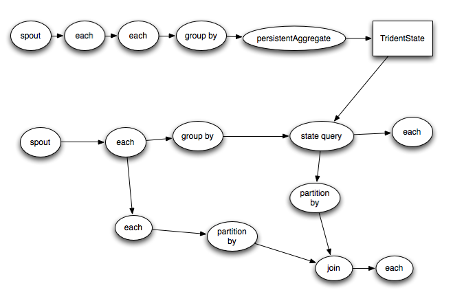

# Trident tutorial

Trident is a high-level abstraction for doing realtime computing on top of Storm. It allows you to seamlessly intermix high throughput (millions of messages per second), stateful stream processing with low latency distributed querying. If you're familiar with high level batch processing tools like Pig or Cascading, the concepts of Trident will be very familiar – Trident has joins, aggregations, grouping, functions, and filters. In addition to these, Trident adds primitives for doing stateful, incremental processing on top of any database or persistence store. Trident has consistent, exactly-once semantics, so it is easy to reason about Trident topologies.

## Illustrative example

Let's look at an illustrative example of Trident. This example will do two things:

1. Compute streaming word count from an input stream of sentences
2. Implement queries to get the sum of the counts for a list of words

For the purposes of illustration, this example will read an infinite stream of sentences from the following source:

```java
FixedBatchSpout spout = new FixedBatchSpout(new Fields("sentence"), 3,
               new Values("the cow jumped over the moon"),
               new Values("the man went to the store and bought some candy"),
               new Values("four score and seven years ago"),
               new Values("how many apples can you eat"));
spout.setCycle(true);
```

This spout cycles through that set of sentences over and over to produce the sentence stream. Here's the code to do the streaming word count part of the computation:

```java
TridentTopology topology = new TridentTopology();        
TridentState wordCounts =
     topology.newStream("spout1", spout)
       .each(new Fields("sentence"), new Split(), new Fields("word"))
       .groupBy(new Fields("word"))
       .persistentAggregate(new MemoryMapState.Factory(), new Count(), new Fields("count"))                
       .parallelismHint(6);
```

Let's go through the code line by line. First a TridentTopology object is created, which exposes the interface for constructing Trident computations. TridentTopology has a method called newStream that creates a new stream of data in the topology reading from an input source. In this case, the input source is just the FixedBatchSpout defined from before. Input sources can also be queue brokers like Kestrel or Kafka. Trident keeps track of a small amount of state for each input source (metadata about what it has consumed) in Zookeeper, and the "spout1" string here specifies the node in Zookeeper where Trident should keep that metadata.

Trident processes the stream as small batches of tuples. For example, the incoming stream of sentences might be divided into batches like so:


Generally the size of those small batches will be on the order of thousands or millions of tuples, depending on your incoming throughput.

Trident provides a fully fledged batch processing API to process those small batches. The API is very similar to what you see in high level abstractions for Hadoop like Pig or Cascading: you can do group by's, joins, aggregations, run functions, run filters, and so on. Of course, processing each small batch in isolation isn't that interesting, so Trident provides functions for doing aggregations across batches and persistently storing those aggregations – whether in memory, in Memcached, in Cassandra, or some other store. Finally, Trident has first-class functions for querying sources of realtime state. That state could be updated by Trident (like in this example), or it could be an independent source of state.

Back to the example, the spout emits a stream containing one field called "sentence". The next line of the topology definition applies the Split function to each tuple in the stream, taking the "sentence" field and splitting it into words. Each sentence tuple creates potentially many word tuples – for instance, the sentence "the cow jumped over the moon" creates six "word" tuples. Here's the definition of Split:

```java
public class Split extends BaseFunction {
   public void execute(TridentTuple tuple, TridentCollector collector) {
       String sentence = tuple.getString(0);
       for(String word: sentence.split(" ")) {
           collector.emit(new Values(word));                
       }
   }
}
```

As you can see, it's really simple. It simply grabs the sentence, splits it on whitespace, and emits a tuple for each word.

The rest of the topology computes word count and keeps the results persistently stored. First the stream is grouped by the "word" field. Then, each group is persistently aggregated using the Count aggregator. The persistentAggregate function knows how to store and update the results of the aggregation in a source of state. In this example, the word counts are kept in memory, but this can be trivially swapped to use Memcached, Cassandra, or any other persistent store. Swapping this topology to store counts in Memcached is as simple as replacing the persistentAggregate line with this (using [trident-memcached](https://github.com/nathanmarz/trident-memcached)), where the "serverLocations" is a list of host/ports for the Memcached cluster:

```java
.persistentAggregate(MemcachedState.transactional(serverLocations), new Count(), new Fields("count"))        
MemcachedState.transactional()
```

The values stored by persistentAggregate represents the aggregation of all batches ever emitted by the stream.

One of the cool things about Trident is that it has fully fault-tolerant, exactly-once processing semantics. This makes it easy to reason about your realtime processing. Trident persists state in a way so that if failures occur and retries are necessary, it won't perform multiple updates to the database for the same source data.

The persistentAggregate method transforms a Stream into a TridentState object. In this case the TridentState object represents all the word counts. We will use this TridentState object to implement the distributed query portion of the computation.

The next part of the topology implements a low latency distributed query on the word counts. The query takes as input a whitespace separated list of words and return the sum of the counts for those words. These queries are executed just like normal RPC calls, except they are parallelized in the background. Here's an example of how you might invoke one of these queries:

```java
DRPCClient client = new DRPCClient("drpc.server.location", 3772);
System.out.println(client.execute("words", "cat dog the man");
// prints the JSON-encoded result, e.g.: "[[5078]]"
```

As you can see, it looks just like a regular remote procedure call (RPC), except it's executing in parallel across a Storm cluster. The latency for small queries like this are typically around 10ms. More intense DRPC queries can take longer of course, although the latency largely depends on how many resources you have allocated for the computation.

The implementation of the distributed query portion of the topology looks like this:

```java
topology.newDRPCStream("words")
       .each(new Fields("args"), new Split(), new Fields("word"))
       .groupBy(new Fields("word"))
       .stateQuery(wordCounts, new Fields("word"), new MapGet(), new Fields("count"))
       .each(new Fields("count"), new FilterNull())
       .aggregate(new Fields("count"), new Sum(), new Fields("sum"));
```

The same TridentTopology object is used to create the DRPC stream, and the function is named "words". The function name corresponds to the function name given in the first argument of execute when using a DRPCClient.

Each DRPC request is treated as its own little batch processing job that takes as input a single tuple representing the request. The tuple contains one field called "args" that contains the argument provided by the client. In this case, the argument is a whitespace separated list of words.

First, the Split function is used to split the arguments for the request into its constituent words. The stream is grouped by "word", and the stateQuery operator is used to query the TridentState object that the first part of the topology generated. stateQuery takes in a source of state – in this case, the word counts computed by the other portion of the topology – and a function for querying that state. In this case, the MapGet function is invoked, which gets the count for each word. Since the DRPC stream is grouped the exact same way as the TridentState was (by the "word" field), each word query is routed to the exact partition of the TridentState object that manages updates for that word.

Next, words that didn't have a count are filtered out via the FilterNull filter and the counts are summed using the Sum aggregator to get the result. Then, Trident automatically sends the result back to the waiting client.

Trident is intelligent about how it executes a topology to maximize performance. There's two interesting things happening automatically in this topology:

1. Operations that read from or write to state (like persistentAggregate and stateQuery) automatically batch operations to that state. So if there's 20 updates that need to be made to the database for the current batch of processing, rather than do 20 read requests and 20 writes requests to the database, Trident will automatically batch up the reads and writes, doing only 1 read request and 1 write request (and in many cases, you can use caching in your State implementation to eliminate the read request). So you get the best of both words of convenience – being able to express your computation in terms of what should be done with each tuple – and performance.
2. Trident aggregators are heavily optimized. Rather than transfer all tuples for a group to the same machine and then run the aggregator, Trident will do partial aggregations when possible before sending tuples over the network. For example, the Count aggregator computes the count on each partition, sends the partial count over the network, and then sums together all the partial counts to get the total count. This technique is similar to the use of combiners in MapReduce.

Let's look at another example of Trident.

## Reach

The next example is a pure DRPC topology that computes the reach of a URL on demand. Reach is the number of unique people exposed to a URL on Twitter. To compute reach, you need to fetch all the people who ever tweeted a URL, fetch all the followers of all those people, unique that set of followers, and that count that uniqued set. Computing reach is too intense for a single machine – it can require thousands of database calls and tens of millions of tuples. With Storm and Trident, you can parallelize the computation of each step across a cluster.

This topology will read from two sources of state. One database maps URLs to a list of people who tweeted that URL. The other database maps a person to a list of followers for that person. The topology definition looks like this:

```java
TridentState urlToTweeters =
       topology.newStaticState(getUrlToTweetersState());
TridentState tweetersToFollowers =
       topology.newStaticState(getTweeterToFollowersState());

topology.newDRPCStream("reach")
       .stateQuery(urlToTweeters, new Fields("args"), new MapGet(), new Fields("tweeters"))
       .each(new Fields("tweeters"), new ExpandList(), new Fields("tweeter"))
       .shuffle()
       .stateQuery(tweetersToFollowers, new Fields("tweeter"), new MapGet(), new Fields("followers"))
       .parallelismHint(200)
       .each(new Fields("followers"), new ExpandList(), new Fields("follower"))
       .groupBy(new Fields("follower"))
       .aggregate(new One(), new Fields("one"))
       .parallelismHint(20)
       .aggregate(new Count(), new Fields("reach"));
```

The topology creates TridentState objects representing each external database using the newStaticState method. These can then be queried in the topology. Like all sources of state, queries to these databases will be automatically batched for maximum efficiency.

The topology definition is straightforward – it's just a simple batch processing job. First, the urlToTweeters database is queried to get the list of people who tweeted the URL for this request. That returns a list, so the ExpandList function is invoked to create a tuple for each tweeter.

Next, the followers for each tweeter must be fetched. It's important that this step be parallelized, so shuffle is invoked to evenly distribute the tweeters among all workers for the topology. Then, the followers database is queried to get the list of followers for each tweeter. You can see that this portion of the topology is given a large parallelism since this is the most intense portion of the computation.

Next, the set of followers is uniqued and counted. This is done in two steps. First a "group by" is done on the batch by "follower", running the "One" aggregator on each group. The "One" aggregator simply emits a single tuple containing the number one for each group. Then, the ones are summed together to get the unique count of the followers set. Here's the definition of the "One" aggregator:

```java
public class One implements CombinerAggregator<Integer> {
   public Integer init(TridentTuple tuple) {
       return 1;
   }

   public Integer combine(Integer val1, Integer val2) {
       return 1;
   }

   public Integer zero() {
       return 1;
   }        
}
```

This is a "combiner aggregator", which knows how to do partial aggregations before transferring tuples over the network to maximize efficiency. Sum is also defined as a combiner aggregator, so the global sum done at the end of the topology will be very efficient.

Let's now look at Trident in more detail.

## Fields and tuples

The Trident data model is the TridentTuple which is a named list of values. During a topology, tuples are incrementally built up through a sequence of operations. Operations generally take in a set of input fields and emit a set of "function fields". The input fields are used to select a subset of the tuple as input to the operation, while the "function fields" name the fields the operation emits.

Consider this example. Suppose you have a stream called "stream" that contains the fields "x", "y", and "z". To run a filter MyFilter that takes in "y" as input, you would say:

```java
stream.each(new Fields("y"), new MyFilter())
```

Suppose the implementation of MyFilter is this:

```java
public class MyFilter extends BaseFilter {
   public boolean isKeep(TridentTuple tuple) {
       return tuple.getInteger(0) < 10;
   }
}
```

This will keep all tuples whose "y" field is less than 10. The TridentTuple given as input to MyFilter will only contain the "y" field. Note that Trident is able to project a subset of a tuple extremely efficiently when selecting the input fields: the projection is essentially free.

Let's now look at how "function fields" work. Suppose you had this function:

```java
public class AddAndMultiply extends BaseFunction {
   public void execute(TridentTuple tuple, TridentCollector collector) {
       int i1 = tuple.getInteger(0);
       int i2 = tuple.getInteger(1);
       collector.emit(new Values(i1 + i2, i1 * i2));
   }
}
```

This function takes two numbers as input and emits two new values: the addition of the numbers and the multiplication of the numbers. Suppose you had a stream with the fields "x", "y", and "z". You would use this function like this:

```java
stream.each(new Fields("x", "y"), new AddAndMultiply(), new Fields("added", "multiplied"));
```

The output of functions is additive: the fields are added to the input tuple. So the output of this each call would contain tuples with the five fields "x", "y", "z", "added", and "multiplied". "added" corresponds to the first value emitted by AddAndMultiply, while "multiplied" corresponds to the second value.

With aggregators, on the other hand, the function fields replace the input tuples. So if you had a stream containing the fields "val1" and "val2", and you did this:

```java
stream.aggregate(new Fields("val2"), new Sum(), new Fields("sum"))
```

The output stream would only contain a single tuple with a single field called "sum", representing the sum of all "val2" fields in that batch.

With grouped streams, the output will contain the grouping fields followed by the fields emitted by the aggregator. For example:

```java
stream.groupBy(new Fields("val1"))
     .aggregate(new Fields("val2"), new Sum(), new Fields("sum"))
```

In this example, the output will contain the fields "val1" and "sum".

## State

A key problem to solve with realtime computation is how to manage state so that updates are idempotent in the face of failures and retries. It's impossible to eliminate failures, so when a node dies or something else goes wrong, batches need to be retried. The question is – how do you do state updates (whether external databases or state internal to the topology) so that it's like each message was only processed only once?

This is a tricky problem, and can be illustrated with the following example. Suppose that you're doing a count aggregation of your stream and want to store the running count in a database. If you store only the count in the database and it's time to apply a state update for a batch, there's no way to know if you applied that state update before. The batch could have been attempted before, succeeded in updating the database, and then failed at a later step. Or the batch could have been attempted before and failed to update the database. You just don't know.

Trident solves this problem by doing two things:

1. Each batch is given a unique id called the "transaction id". If a batch is retried it will have the exact same transaction id.
2. State updates are ordered among batches. That is, the state updates for batch 3 won't be applied until the state updates for batch 2 have succeeded.

With these two primitives, you can achieve exactly-once semantics with your state updates. Rather than store just the count in the database, what you can do instead is store the transaction id with the count in the database as an atomic value. Then, when updating the count, you can just compare the transaction id in the database with the transaction id for the current batch. If they're the same, you skip the update – because of the strong ordering, you know for sure that the value in the database incorporates the current batch. If they're different, you increment the count.

Of course, you don't have to do this logic manually in your topologies. This logic is wrapped by the State abstraction and done automatically. Nor is your State object required to implement the transaction id trick: if you don't want to pay the cost of storing the transaction id in the database, you don't have to. In that case the State will have at-least-once-processing semantics in the case of failures (which may be fine for your application). You can read more about how to implement a State and the various fault-tolerance tradeoffs possible [in this doc](Trident-state.html).

A State is allowed to use whatever strategy it wants to store state. So it could store state in an external database or it could keep the state in-memory but backed by HDFS (like how HBase works). State's are not required to hold onto state forever. For example, you could have an in-memory State implementation that only keeps the last X hours of data available and drops anything older. Take a look at the implementation of the [Memcached integration](https://github.com/nathanmarz/trident-memcached/blob/master/src/jvm/trident/memcached/MemcachedState.java) for an example State implementation.

## Execution of Trident topologies

Trident topologies compile down into as efficient of a Storm topology as possible. Tuples are only sent over the network when a repartitioning of the data is required, such as if you do a groupBy or a shuffle. So if you had this Trident topology:



It would compile into Storm spouts/bolts like this:


## Conclusion

Trident makes realtime computation elegant. You've seen how high throughput stream processing, state manipulation, and low-latency querying can be seamlessly intermixed via Trident's API. Trident lets you express your realtime computations in a natural way while still getting maximal performance.
