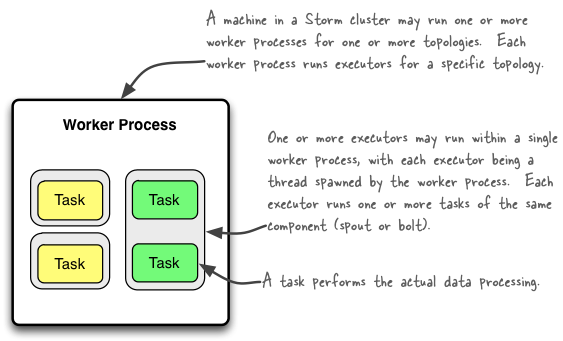
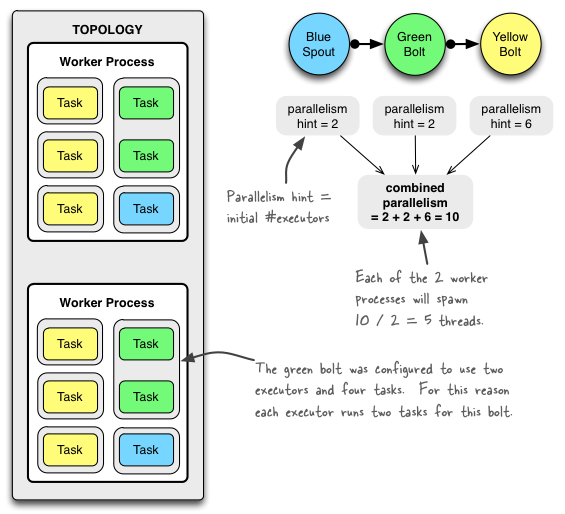

## What makes a running topology: worker processes, executors and tasks

Storm distinguishes between the following three main entities that are used to actually run a topology in a Storm cluster:

1. Worker processes
2. Executors (threads)
3. Tasks

Here is a simple illustration of their relationships:



A _worker process_ executes a subset of a topology. A worker process belongs to a specific topology and may run one or more executors for one or more components (spouts or bolts) of this topology. A running topology consists of many such processes running on many machines within a Storm cluster.

An _executor_ is a thread that is spawned by a worker process. It may run one or more tasks for the same component (spout or bolt).

A _task_ performs the actual data processing — each spout or bolt that you implement in your code executes as many tasks across the cluster. The number of tasks for a component is always the same throughout the lifetime of a topology, but the number of executors (threads) for a component can change over time. This means that the following condition holds true: ``#threads ≤ #tasks``. By default, the number of tasks is set to be the same as the number of executors, i.e. Storm will run one task per thread.

## Configuring the parallelism of a topology

Note that in Storm’s terminology "parallelism" is specifically used to describe the so-called _parallelism hint_, which means the initial number of executor (threads) of a component. In this document though we use the term "parallelism" in a more general sense to describe how you can configure not only the number of executors but also the number of worker processes and the number of tasks of a Storm topology. We will specifically call out when "parallelism" is used in the normal, narrow definition of Storm.

The following sections give an overview of the various configuration options and how to set them in your code. There is more than one way of setting these options though, and the table lists only some of them. Storm currently has the following [order of precedence for configuration settings](Configuration.html): ``defaults.yaml`` < ``storm.yaml`` < topology-specific configuration < internal component-specific configuration < external component-specific configuration.

### Number of worker processes

* Description: How many worker processes to create _for the topology_ across machines in the cluster.
* Configuration option: [TOPOLOGY_WORKERS](javadocs/backtype/storm/Config.html#TOPOLOGY_WORKERS)
* How to set in your code (examples):
    * [Config#setNumWorkers](javadocs/backtype/storm/Config.html)

### Number of executors (threads)

* Description: How many executors to spawn _per component_.
* Configuration option: None (pass ``parallelism_hint`` parameter to ``setSpout`` or ``setBolt``)
* How to set in your code (examples):
    * [TopologyBuilder#setSpout()](javadocs/backtype/storm/topology/TopologyBuilder.html)
    * [TopologyBuilder#setBolt()](javadocs/backtype/storm/topology/TopologyBuilder.html)
    * Note that as of Storm 0.8 the ``parallelism_hint`` parameter now specifies the initial number of executors (not tasks!) for that bolt.

### Number of tasks

* Description: How many tasks to create _per component_.
* Configuration option: [TOPOLOGY_TASKS](javadocs/backtype/storm/Config.html#TOPOLOGY_TASKS)
* How to set in your code (examples):
    * [ComponentConfigurationDeclarer#setNumTasks()](javadocs/backtype/storm/topology/ComponentConfigurationDeclarer.html)


Here is an example code snippet to show these settings in practice:

```java
topologyBuilder.setBolt("green-bolt", new GreenBolt(), 2)
               .setNumTasks(4)
               .shuffleGrouping("blue-spout");
```

In the above code we configured Storm to run the bolt ``GreenBolt`` with an initial number of two executors and four associated tasks. Storm will run two tasks per executor (thread). If you do not explicitly configure the number of tasks, Storm will run by default one task per executor.

## Example of a running topology

The following illustration shows how a simple topology would look like in operation. The topology consists of three components: one spout called ``BlueSpout`` and two bolts called ``GreenBolt`` and ``YellowBolt``. The components are linked such that ``BlueSpout`` sends its output to ``GreenBolt``, which in turns sends its own output to ``YellowBolt``.



The ``GreenBolt`` was configured as per the code snippet above whereas ``BlueSpout`` and ``YellowBolt`` only set the parallelism hint (number of executors). Here is the relevant code:

```java
Config conf = new Config();
conf.setNumWorkers(2); // use two worker processes

topologyBuilder.setSpout("blue-spout", new BlueSpout(), 2); // set parallelism hint to 2

topologyBuilder.setBolt("green-bolt", new GreenBolt(), 2)
               .setNumTasks(4)
               .shuffleGrouping("blue-spout");

topologyBuilder.setBolt("yellow-bolt", new YellowBolt(), 6)
               .shuffleGrouping("green-bolt");

StormSubmitter.submitTopology(
        "mytopology",
        conf,
        topologyBuilder.createTopology()
    );
```

And of course Storm comes with additional configuration settings to control the parallelism of a topology, including:

* [TOPOLOGY_MAX_TASK_PARALLELISM](javadocs/backtype/storm/Config.html#TOPOLOGY_MAX_TASK_PARALLELISM): This setting puts a ceiling on the number of executors that can be spawned for a single component. It is typically used during testing to limit the number of threads spawned when running a topology in local mode. You can set this option via e.g. [Config#setMaxTaskParallelism()](javadocs/backtype/storm/Config.html#setMaxTaskParallelism(int)).

## How to change the parallelism of a running topology

A nifty feature of Storm is that you can increase or decrease the number of worker processes and/or executors without being required to restart the cluster or the topology. The act of doing so is called rebalancing.

You have two options to rebalance a topology:

1. Use the Storm web UI to rebalance the topology.
2. Use the CLI tool storm rebalance as described below.

Here is an example of using the CLI tool:

```
## Reconfigure the topology "mytopology" to use 5 worker processes,
## the spout "blue-spout" to use 3 executors and
## the bolt "yellow-bolt" to use 10 executors.

$ storm rebalance mytopology -n 5 -e blue-spout=3 -e yellow-bolt=10
```

## References

* [Concepts](Concepts.html)
* [Configuration](Configuration.html)
* [Running topologies on a production cluster](Running-topologies-on-a-production-cluster.html)]
* [Local mode](Local-mode.html)
* [Tutorial](Tutorial.html)
* [Storm API documentation](javadocs/), most notably the class ``Config``

