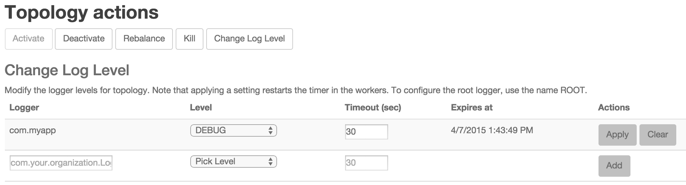
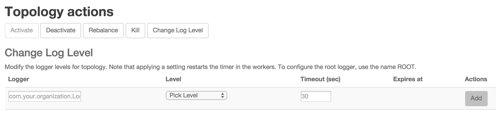

We have added the ability to set log level settings for a running topology using the Storm UI and the Storm CLI. 

The log level settings apply the same way as you'd expect from log4j, as all we are doing is telling log4j to set the level of the logger you provide. If you set the log level of a parent logger, the children loggers start using that level (unless the children have a more restrictive level already). A timeout can optionally be provided (except for DEBUG mode, where it’s required in the UI), if workers should reset log levels automatically.

This revert action is triggered using a polling mechanism (every 30 seconds, but this is configurable), so you should expect your timeouts to be the value you provided plus anywhere between 0 and the setting's value.

Using the Storm UI
-------------

In order to set a level, click on a running topology, and then click on “Change Log Level” in the Topology Actions section.

Next, provide the logger name, select the level you expect (e.g. WARN), and a timeout in seconds (or 0 if not needed). Then click on “Add”.

To clear the log level click on the “Clear” button. This reverts the log level back to what it was before you added the setting. The log level line will disappear from the UI.

While there is a delay resetting log levels back, setting the log level in the first place is immediate (or as quickly as the message can travel from the UI/CLI to the workers by way of nimbus and zookeeper).

Using the CLI
-------------

Using the CLI, issue the command:

`./bin/storm set_log_level [topology name] -l [logger name]=[LEVEL]:[TIMEOUT]`

For example:

`./bin/storm set_log_level my_topology -l ROOT=DEBUG:30`

Sets the ROOT logger to DEBUG for 30 seconds.

`./bin/storm set_log_level my_topology -r ROOT`

Clears the ROOT logger dynamic log level, resetting it to its original value.

