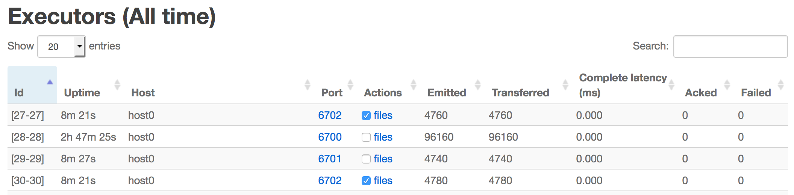
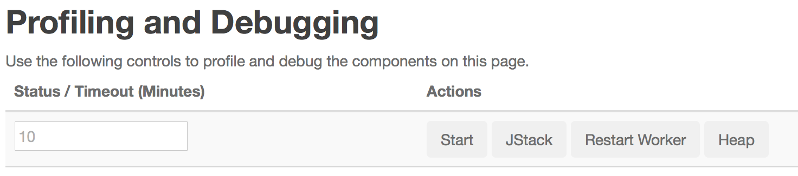
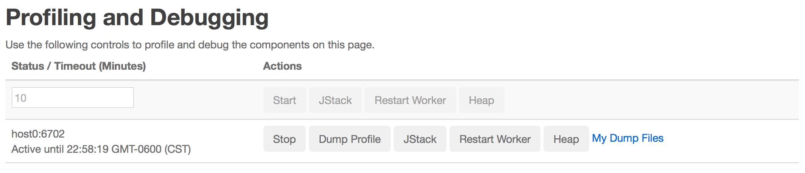

In multi-tenant mode, storm launches long-running JVMs across cluster without sudo access to user. Self-serving of Java heap-dumps, jstacks and java profiling of these JVMs would improve users' ability to analyze and debug issues when monitoring it actively.

The storm dynamic profiler lets you dynamically take heap-dumps, jprofile or jstack for a worker jvm running on stock cluster. It let user download these dumps from the browser and use your favorite tools to analyze it  The UI component page provides list workers for the component and action buttons. The logviewer lets you download the dumps generated by these logs. Please see the screenshots for more information.

Using the Storm UI
-------------

In order to request for heap-dump, jstack, start/stop/dump jprofile or restart a worker, click on a running topology, then click on specific component, then you can select workers by checking the box of any of the worker's executors in the Executors table, and then click on “Start","Heap", "Jstack" or "Restart Worker" in the "Profiling and Debugging" section.

In the Executors table, click the checkbox in the Actions column next to any executor, and any other executors belonging to the same worker are automatically selected. When the action has completed, any output files created will available at the link in the Actions column.

For start jprofile, provide a timeout in minutes (or 10 if not needed). Then click on “Start”.

To stop the jprofile logging click on the “Stop” button. This dumps the jprofile stats and stops the profiling. Refresh the page for the line to disappear from the UI.

Click on "My Dump Files" to go the logviewer UI for list of worker specific dump files.

Configuration
-------------

The "worker.profiler.command" can be configured to point to specific pluggable profiler, heapdump commands. The "worker.profiler.enabled" can be disabled if plugin is not available or jdk does not support Jprofile flight recording so that worker JVM options will not have "worker.profiler.childopts". To use different profiler plugin, you can change these configuration.

