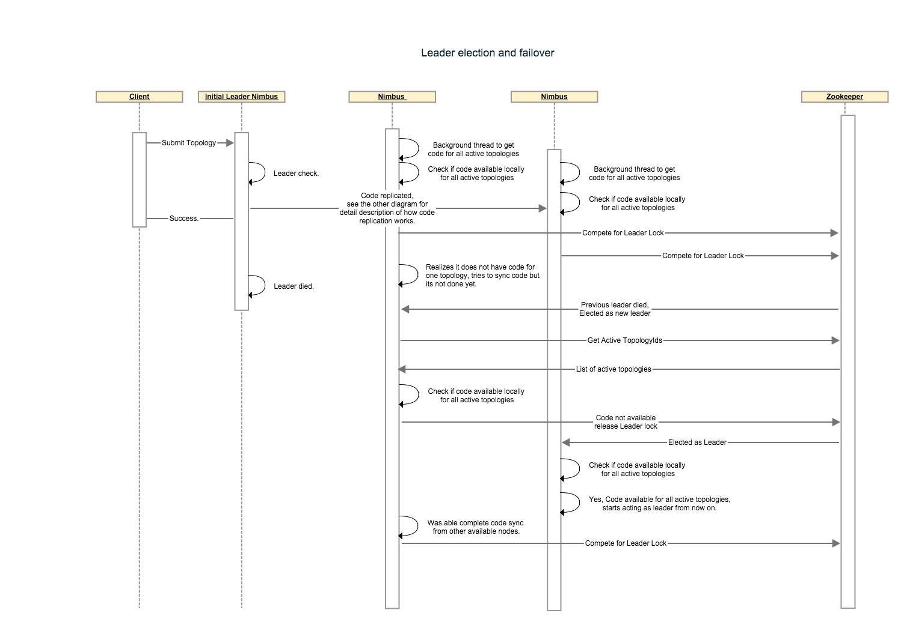
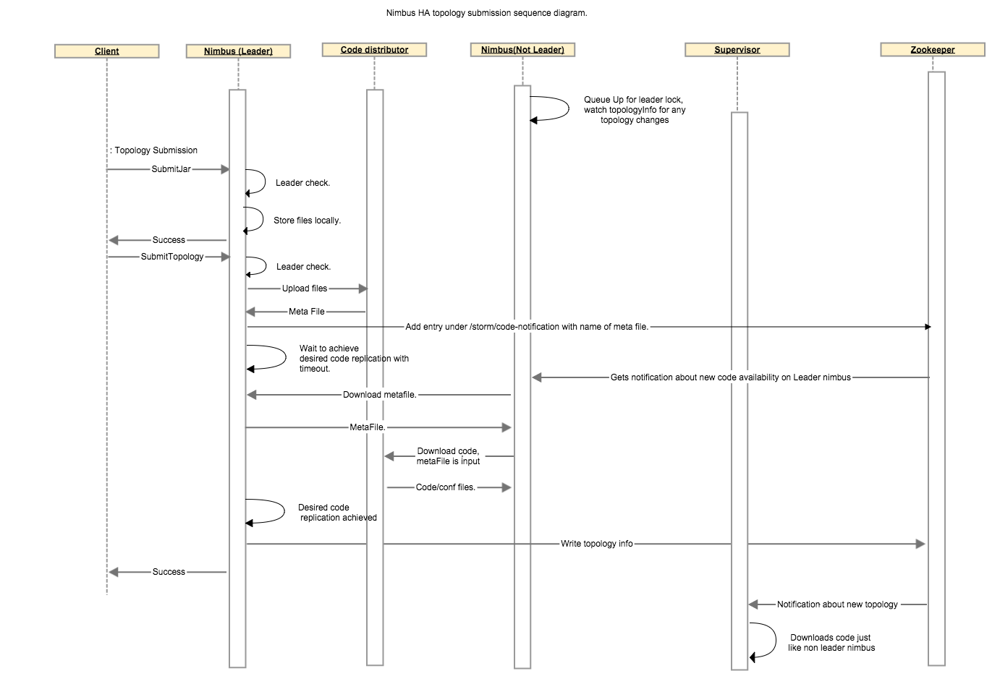

##Problem Statement:
Currently the storm master aka nimbus, is a process that runs on a single machine under supervision. In most cases the 
nimbus failure is transient and it is restarted by the supervisor. However sometimes when disks fail and networks 
partitions occur, nimbus goes down. Under these circumstances the topologies run normally but no new topologies can be 
submitted, no existing topologies can be killed/deactivated/activated and if a supervisor node fails then the 
reassignments are not performed resulting in performance degradation or topology failures. With this project we intend 
to resolve this problem by running nimbus in a primary backup mode to guarantee that even if a nimbus server fails one 
of the backups will take over.
##Requirements:
* Increase overall availability of nimbus.
* Allow nimbus hosts to leave and join the cluster at will any time. A newly joined host should auto catch up and join 
the list of potential leaders automatically. 
* No topology resubmissions required in case of nimbus fail overs.
* No active topology should ever be lost. 

##Leader Election:
The nimbus server will use the following interface:

```java
public interface ILeaderElector {
    /**
     * queue up for leadership lock. The call returns immediately and the caller                     
     * must check isLeader() to perform any leadership action.
     */
    void addToLeaderLockQueue();

    /**
     * Removes the caller from the leader lock queue. If the caller is leader
     * also releases the lock.
     */
    void removeFromLeaderLockQueue();

    /**
     *
     * @return true if the caller currently has the leader lock.
     */
    boolean isLeader();

    /**
     *
     * @return the current leader's address , throws exception if noone has has    lock.
     */
    InetSocketAddress getLeaderAddress();

    /**
     * 
     * @return list of current nimbus addresses, includes leader.
     */
    List<InetSocketAddress> getAllNimbusAddresses();
}
```
On startup nimbus will check if it has code for all active topologies available locally. Once it gets to this state it 
will call addToLeaderLockQueue() function. When a nimbus is notified to become a leader it will check if it has all the
code locally before assuming the leadership role. If any active topology code is missing, the node will not accept the 
leadership role instead it will release the lock and wait till it has all the code before requeueing for leader lock. 

The first implementation will be Zookeeper based. If the zookeeper connection is lost/resetted resulting in loss of lock
or the spot in queue the implementation will take care of updating the state such that isLeader() will reflect the 
current status.The leader like actions must finish in less than minimumOf(connectionTimeout, SessionTimeout) to ensure
the lock was held by nimbus for the entire duration of the action (Not sure if we want to just state this expectation 
and ensure that zk configurations are set high enough which will result in higher failover time or we actually want to 
create some sort of rollback mechanism for all actions, the second option needs a lot of code). If a nimbus that is not 
leader receives a request that only a leader can perform it will throw a RunTimeException.

Following steps describes a nimbus failover scenario:
* Let’s say we have 4 topologies running with 3 nimbus nodes and code-replication-factor = 2. We assume that the 
invariant “The leader nimbus has code for all topologies locally” holds true at the beginning. nonleader-1 has code for 
the first 2 topologies and nonLeader-2 has code for the other 2 topologies.
* Leader nimbus dies, hard disk failure so no recovery possible.
* nonLeader-1 gets a zookeeper notification to indicate it is now the new leader. before accepting the leadership it 
checks if it has code available for all 4 topologies(these are topologies under /storm/storms/). It realizes it only has
code for 2 topologies so it relinquishes the lock and looks under  /storm/code-distributor/topologyId to find out from 
where can it download the code/metafile for the missing topologies. it finds entries for the leader nimbus and 
nonleader-2. It will try downloading from both as part of its retry mechanism.
* nonLeader-2’s code sync thread also realizes that it is missing code for 2 topologies and follows the same process 
described in step-3 to download code for missing topologies. 
* eventually at least one of the nimbuses will have all the code locally and will accept leadership.
This sequence diagram describes how leader election and failover would work with multiple components.



##Nimbus state store:

Currently the nimbus stores 2 kind of data
* Meta information like supervisor info, assignment info which is stored in zookeeper
* Actual topology configs and jars that is stored on nimbus host’s local disk.

To achieve fail over from primary to backup servers nimbus state/data needs to be replicated across all nimbus hosts or 
needs to be stored in a distributed storage. Replicating the data correctly involves state management, consistency checks
and it is hard to test for correctness.However many storm users do not want to take extra dependency on another replicated
storage system like HDFS and still need high availability.Eventually, we want to move to the bittorrent protocol for code 
distribution given the size of the jars and to achieve better scaling when the total number of supervisors is very high. 
The current file system based model for code distribution works fine with systems that have file system like structure
but it fails to support a non file system based approach like bit torrent. To support bit torrent and all the file
system based replicated storage systems we propose the following interface:

```java
/**
 * Interface responsible to distribute code in the cluster.
 */
public interface ICodeDistributor {
    /**
     * Prepare this code distributor.
     * @param conf
     */
    void prepare(Map conf);

    /**
     * This API will perform the actual upload of the code to the distributed implementation.
     * The API should return a Meta file which should have enough information for downloader 
     * so it can download the code e.g. for bittorrent it will be a torrent file, in case of something         
     * like HDFS or s3  it might have the actual directory or paths for files to be downloaded.
     * @param dirPath local directory where all the code to be distributed exists.
     * @param topologyId the topologyId for which the meta file needs to be created.
     * @return metaFile
     */
    File upload(Path dirPath, String topologyId);

    /**
     * Given the topologyId and metafile, download the actual code and return the downloaded file's list.
     * @param topologyid
     * @param metafile 
     * @param destDirPath the folder where all the files will be downloaded.
     * @return
     */
    List<File> download(Path destDirPath, String topologyid, File metafile);

    /**
      * Given the topologyId, returns number of hosts where the code has been replicated.
      */
    int getReplicationCount(String topologyId);
    
   /**
     * Performs the cleanup.
     * @param topologyid
     */
    void cleanup(String topologyid);

    /**
     * Close this distributor.
     * @param conf
     */
    void close(Map conf);
}
```
To support replication we will allow the user to define a code replication factor which would reflect number of nimbus 
hosts to which the code must be replicated before starting the topology. With replication comes the issue of consistency. 
We will treat zookeeper’s list of active topologies as our authority for topologies for which the code must exist on a 
nimbus host. Any nimbus host that does not have all the code for all the topologies which are marked as active in zookeeper 
will relinquish it’s lock so some other nimbus host could become leader. A background thread on all nimbus host will 
continuously try to sync code from other hosts where the code was successfully replicated so eventually at least one nimbus 
will accept leadership as long as at least one seed hosts exists for each active topology. 
		
Following steps describe code replication amongst nimbus hosts for a topology:
* When client uploads jar, nothing changes.
* When client submits a topology, leader nimbus calls code distributor’s upload function which will create a metafile stored 
locally on leader nimbus. Leader nimbus will write new entries under /storm/code-distributor/topologyId to notify all 
nonleader nimbuses that they should download this new code.
* We wait on the leader nimbus to ensure at least N non leader nimbus has the code replicated, with a user configurable timeout.
* When a non leader nimbus receives the notification about new code, it downloads the meta file from leader nimbus and then
downloads the real code by calling code distributor’s download function with metafile as input.
* Once non leader finishes downloading code, it will write an entry under /storm/code-distributor/topologyId to indicate 
it is one of the possible places to download the code/metafile in case the leader nimbus dies.
* leader nimbus goes ahead and does all the usual things it does as part of submit topologies.

The following sequence diagram describes the communication between different components involved in code distribution.



##Thrift and Rest API 
In order to avoid workers/supervisors/ui talking to zookeeper for getting master nimbus address we are going to modify the 
`getClusterInfo` API so it can also return nimbus information. getClusterInfo currently returns `ClusterSummary` instance
which has a list of `supervisorSummary` and a list of 'topologySummary` instances. We will add a list of `NimbusSummary` 
to the `ClusterSummary`. See the structures below:

```thrift
struct ClusterSummary {
  1: required list<SupervisorSummary> supervisors;
  3: required list<TopologySummary> topologies;
  4: required list<NimbusSummary> nimbuses;
}

struct NimbusSummary {
  1: required string host;
  2: required i32 port;
  3: required i32 uptime_secs;
  4: required bool isLeader;
  5: required string version;
}
```

This will be used by StormSubmitter, Nimbus clients,supervisors and ui to discover the current leaders and participating 
nimbus hosts. Any nimbus host will be able to respond to these requests. The nimbus hosts can read this information once 
from zookeeper and cache it and keep updating the cache when the watchers are fired to indicate any changes,which should 
be rare in general case.

## Configuration
You can use nimbus ha with default configuration , however the default configuration assumes a single nimbus host so it
trades off replication for lower topology submission latency. Depending on your use case you can adjust following configurations:
* storm.codedistributor.class : This is a string representing fully qualified class name of a class that implements
org.apache.storm.codedistributor.ICodeDistributor. The default is set to "org.apache.storm.codedistributor.LocalFileSystemCodeDistributor".
This class leverages local file system to store both meta files and code/configs. This class adds extra load on zookeeper as even after
downloading the code-distrbutor meta file it contacts zookeeper in order to figure out hosts from where it can download
actual code/config and to get the current replication count. An alternative is to use 
"org.apache.storm.hdfs.ha.codedistributor.HDFSCodeDistributor" which relies on HDFS but does not add extra load on zookeeper and will 
make topology submission faster.
* topology.min.replication.count : Minimum number of nimbus hosts where the code must be replicated before leader nimbus
can mark the topology as active and create assignments. Default is 1.
* topology.max.replication.wait.time.sec: Maximum wait time for the nimbus host replication to achieve the nimbus.min.replication.count.
Once this time is elapsed nimbus will go ahead and perform topology activation tasks even if required nimbus.min.replication.count is not achieved. 
The default is 60 seconds, a value of -1 indicates to wait for ever.
*nimbus.code.sync.freq.secs: frequency at which the background thread on nimbus which syncs code for locally missing topologies will run. default is 5 minutes.

Note: Even though all nimbus hosts have watchers on zookeeper to be notified immediately as soon as a new topology is available for code
download, the callback pretty much never results in code download. In practice we have observed that the desired replication is only achieved once the background-thread runs. 
So you should expect your topology submission time to be somewhere between 0 to (2 * nimbus.code.sync.freq.secs) for any nimbus.min.replication.count > 1.
