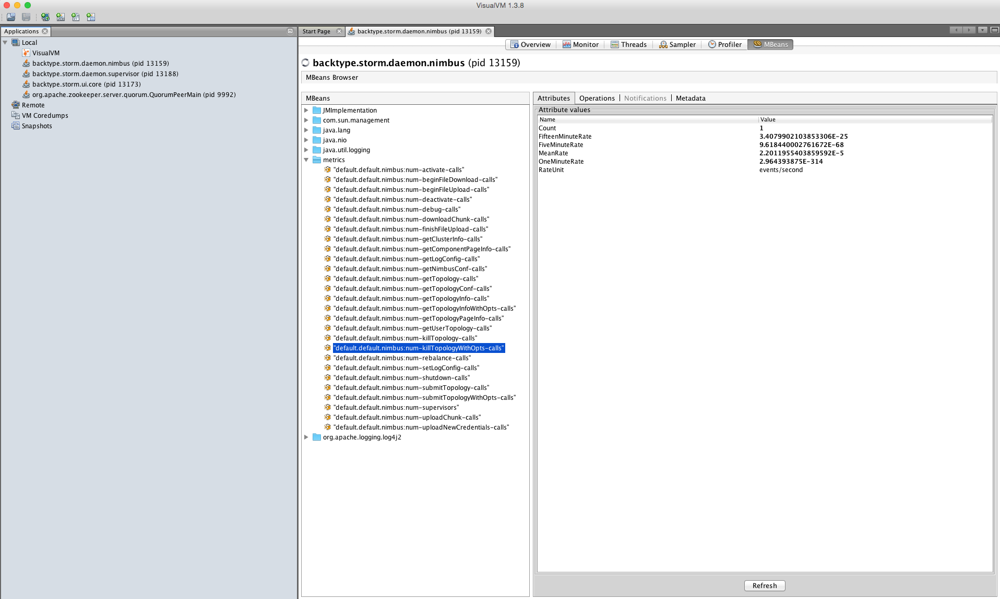

# Storm Metrics for Profiling Various Storm Internal Actions

With the addition of these metrics, Storm users can collect, view, and analyze the performance of various internal actions.  The actions that are profiled include thrift rpc calls and http quests within the storm daemons. For instance, in the Storm Nimbus daemon, the following thrift calls defined in the Nimbus$Iface are profiled:

- submitTopology
- submitTopologyWithOpts
- killTopology
- killTopologyWithOpts
- activate
- deactivate
- rebalance
- setLogConfig
- getLogConfig

Various HTTP GET and POST requests are marked for profiling as well such as the GET and POST requests for the Storm UI daemon (ui/core.cj)
To implement these metrics the following packages are used: 
- io.dropwizard.metrics
- metrics-clojure

## How it works

By using packages io.dropwizard.metrics and metrics-clojure (clojure wrapper for the metrics Java API), we can mark functions to profile by declaring (defmeter num-some-func-calls) and then adding the (mark! num-some-func-calls) to where the function is invoked. For example:

    (defmeter num-some-func-calls)
    (defn some-func [args]
        (mark! num-some-func-calls)
        (body))
        
What essentially the mark! API call does is increment a counter that represents how many times a certain action occured.  For instantanous measurements user can use gauges.  For example: 

    (defgauge nimbus:num-supervisors
         (fn [] (.size (.supervisors (:storm-cluster-state nimbus) nil))))
         
The above example will get the number of supervisors in the cluster.  This metric is not accumlative like one previously discussed.

A metrics reporting server needs to also be activated to collect the metrics. You can do this by calling the following function:

    (defn start-metrics-reporters []
        (jmx/start (jmx/reporter {})))

## How to collect the metrics

Metrics can be reported via JMX or HTTP.  A user can use JConsole or VisualVM to connect to the jvm process and view the stats.

To view the metrics in a GUI use VisualVM or JConsole.  Screenshot of using VisualVm for metrics: 

For detailed information regarding how to collect the metrics please reference: 

https://dropwizard.github.io/metrics/3.1.0/getting-started/

If you want use JMX and view metrics through JConsole or VisualVM, remember launch JVM processes your want to profile with the correct JMX configurations.  For example in Storm you would add the following to conf/storm.yaml

    nimbus.childopts: "-Xmx1024m -Dcom.sun.management.jmxremote.local.only=false -Dcom.sun.management.jmxremote -Dcom.sun.management.jmxremote.port=3333  -Dcom.sun.management.jmxremote.ssl=false -Dcom.sun.management.jmxremote.authenticate=false"
    
    ui.childopts: "-Xmx768m -Dcom.sun.management.jmxremote.port=3334 -Dcom.sun.management.jmxremote.local.only=false -Dcom.sun.management.jmxremote -Dcom.sun.management.jmxremote.ssl=false -Dcom.sun.management.jmxremote.authenticate=false"
    
    logviewer.childopts: "-Xmx128m -Dcom.sun.management.jmxremote.port=3335 -Dcom.sun.management.jmxremote.local.only=false -Dcom.sun.management.jmxremote -Dcom.sun.management.jmxremote.ssl=false -Dcom.sun.management.jmxremote.authenticate=false"
    
    drpc.childopts: "-Xmx768m -Dcom.sun.management.jmxremote.port=3336 -Dcom.sun.management.jmxremote.local.only=false -Dcom.sun.management.jmxremote -Dcom.sun.management.jmxremote.ssl=false -Dcom.sun.management.jmxremote.authenticate=false"
   
    supervisor.childopts: "-Xmx256m -Dcom.sun.management.jmxremote.port=3337 -Dcom.sun.management.jmxremote.local.only=false -Dcom.sun.management.jmxremote -Dcom.sun.management.jmxremote.ssl=false -Dcom.sun.management.jmxremote.authenticate=false"

### Please Note:
Since we shade all of the packages we use, additional plugins for collecting metrics might not work at this time.  Currently collecting the metrics via JMX is supported.
   
For more information about io.dropwizard.metrics and metrics-clojure packages please reference their original documentation:
- https://dropwizard.github.io/metrics/3.1.0/
- http://metrics-clojure.readthedocs.org/en/latest/
