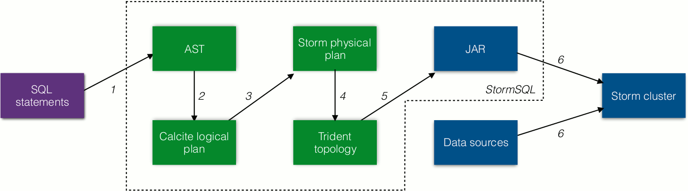
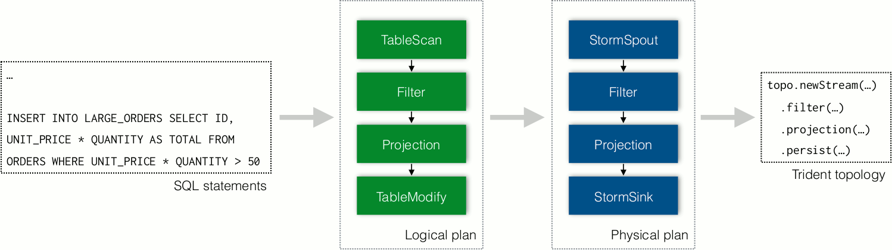

This page describes the design and the implementation of the Storm SQL integration.

## Overview

SQL is a well-adopted yet complicated standard. Several projects including Drill, Hive, Phoenix and Spark have invested significantly in their SQL layers. One of the main design goal of StormSQL is to leverage the existing investments for these projects. StormSQL leverages [Apache Calcite](///calcite.apache.org) to implement the SQL standard. StormSQL focuses on compiling the SQL statements to Storm / Trident topologies so that they can be executed in Storm clusters.

Figure 1 describes the workflow of executing a SQL query in StormSQL. First, users provide a sequence of SQL statements. StormSQL parses the SQL statements and translates them to a Calcite logical plan. A logical plan consists of a sequence of SQL logical operators that describe how the query should be executed irrespective to the underlying execution engines. Some examples of logical operators include `TableScan`, `Filter`, `Projection` and `GroupBy`.

<div align="center">


<p>Figure 1: Workflow of StormSQL.</p>
</div>

The next step is to compile the logical execution plan down to a physical execution plan. A physical plan consists of physical operators that describes how to execute the SQL query in *StormSQL*. Physical operators such as `Filter`, `Projection`, and `GroupBy` are directly mapped to operations in Trident topologies. StormSQL also compiles expressions in the SQL statements into Java byte codes and plugs them into the Trident topologies.

Finally, StormSQL packages both the Java byte codes and the topology into a JAR and submits it to the Storm cluster. Storm schedules and executes the JAR in the same way of it executes other Storm topologies.

The follow code blocks show an example query that filters and projects results from a Kafka stream.

```
CREATE EXTERNAL TABLE ORDERS (ID INT PRIMARY KEY, UNIT_PRICE INT, QUANTITY INT) LOCATION 'kafka://localhost:2181/brokers?topic=orders' ...

CREATE EXTERNAL TABLE LARGE_ORDERS (ID INT PRIMARY KEY, TOTAL INT) LOCATION 'kafka://localhost:2181/brokers?topic=large_orders' ...

INSERT INTO LARGE_ORDERS SELECT ID, UNIT_PRICE * QUANTITY AS TOTAL FROM ORDERS WHERE UNIT_PRICE * QUANTITY > 50
```

The first two SQL statements define the inputs and outputs of external data. Figure 2 describes the processes of how StormSQL takes the last `SELECT` query and compiles it down to Trident topology.

<div align="center">


<p>Figure 2: Compiling the example query to Trident topology.</p>
</div>


## Constraints of querying streaming tables

There are several constraints when querying tables that represent a real-time data stream:

* The `ORDER BY` clause cannot be applied to a stream.
* There is at least one monotonic field in the `GROUP BY` clauses to allow StormSQL bounds the size of the buffer.

For more information please refer to http://calcite.apache.org/docs/stream.html.

## Dependency

StormSQL does not ship the dependency of the external data sources in the packaged JAR. The users have to provide the dependency in the `extlib` directory of the worker node.
